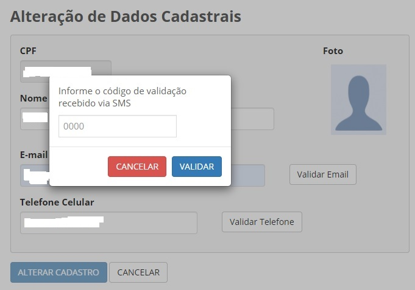

Alterar dados cadastrais? 
=========================

Atualize seus dados dentro do Login Único na opção “Alteração de dados cadastrais” na tela principal.

.. figure:: _images/alteracaodadoscadastraisgovbr.jpg
   :align: center
   :alt: Tela da alteração de dados cadastrais ativa com os campos CPF, nome completo, email, telefone celular

Pode alterar o nome, e-mail e telefone.

Para o email e telefone, existe a necessidade de validação para realizar o cadastro. Deverá clicar no botão **Validar Email** ou **Validar Telefone**  

Na alteração, o Login Único solicitará digitação de uma código encaminhado para email ou celular a ser cadastrado

   
**Possíveis Palavras/Termos (Utilizado para busca no chatbot)**

- alteração de dados cadastrais
- alterar meu cadastro/registro/informação
- alterar dados da minha conta de acesso
- mudar meu cadastro
- reeditar meu cadastro
- preciso mudar meus dados
- quero refazer meus dados
- quero adicionar mais informações/dados/campos/
- posso mudar/modificar/alterar meus dados/informações/registros/
- quero mudar o meu e-mail cadastrado .

.. |site externo| image:: _images/site-ext.gif
            