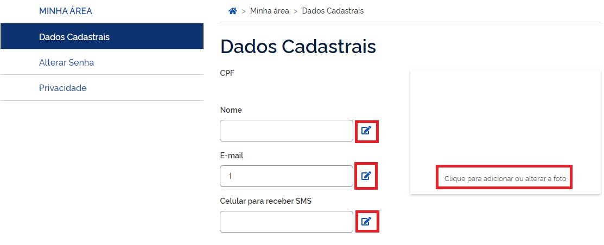
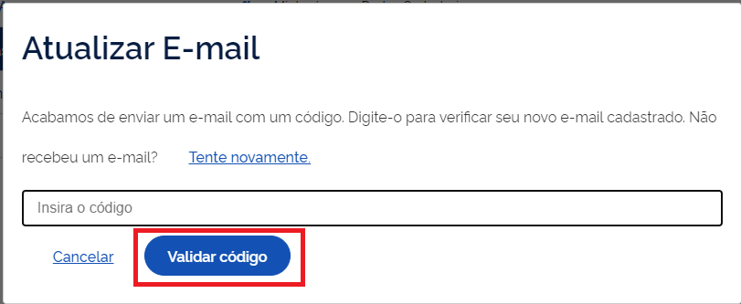

Alterar dados cadastrais
=========================

Atualize seus dados dentro do Login Único na opção **Alteração Dados Cadastrais** na tela principal.

Pode alterar o nome, e-mail, telefone e foto.

Para o email e telefone, existe a necessidade de validação para realizar o cadastro. Deverá clicar no botão **icone azul com lapis** localizado a frente do campo de email ou telefone.

Na alteração, o Login Único solicitará digitação de uma código encaminhado para email ou celular a ser cadastrado

.. |site externo| image:: _images/site-ext.gif
            