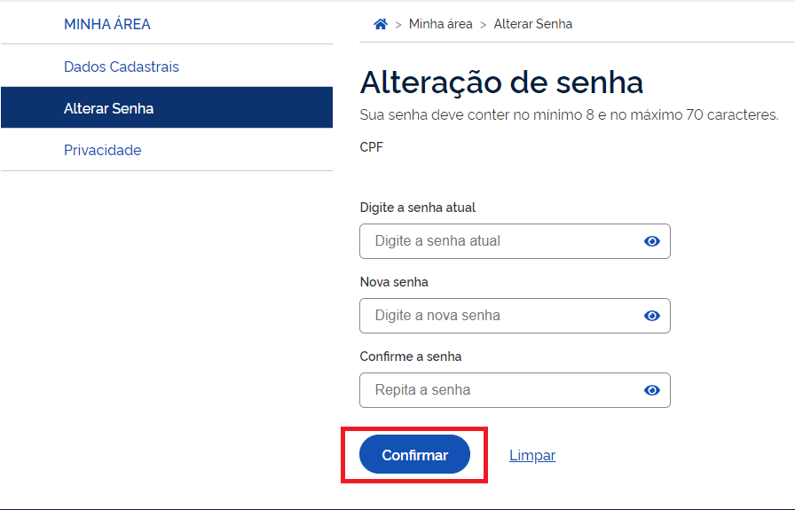

Alterar Senha
==============

Você pode alterar a sua senha a qualquer tempo na opção **Alterar Senha** na tela inicial da Conta gov.br

Informe a senha atual, a nova senha e clique no botão **Confirmar**.

.. |site externo| image:: _images/site-ext.gif
            