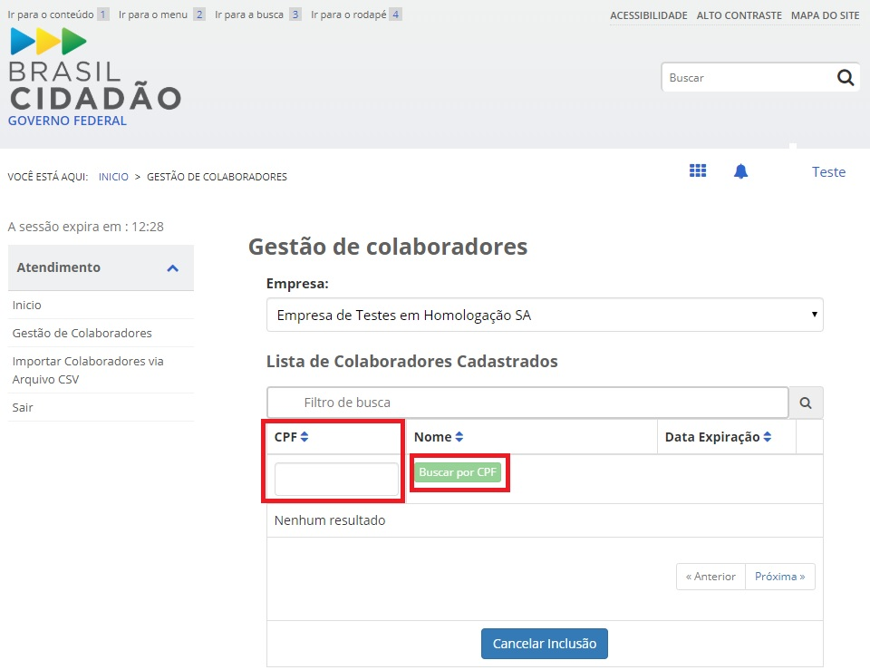
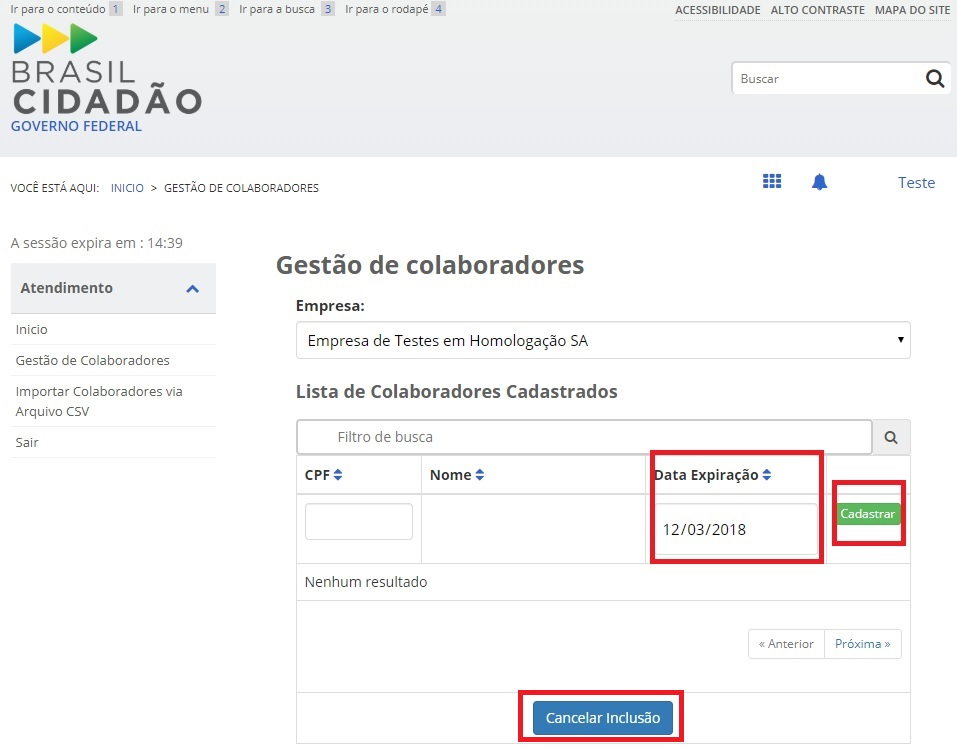

Cadastrato de Colaborador do CNPJ
=================================

O Login Único permite o cadastramento de pessoas que não pertencem diretamente a empresa. Esse cadastro ocorre pela indicação de colaboradores. 

Para realizar o cadastramento de colaboradores, favor seguir os passos:

1. Acesse o `Módulo Empresas`_ e selecione o item **Gestão de Colaboradores**. Lembrar que o responsável pelo cadastramento de colaboradores será o usuário no Login Único que possui `selo eCNPJ`_ e o certificado digital de pessoa jurídica da empresa.    

.. figure:: _images/telainicialmoduloempresas.jpg
   :align: center
   :alt: Página Inicial do módulo empresas que apresenta o CNPJ que o usuário é responsável com itens no menu Gestão de Colaboradores  

2. Selecione a empresa que deseja incluir o colaborador

.. figure:: _images/telamoduloempresasescolhaempresa.jpg
   :align: center
   :alt: Página do módulo empresas que apresenta a seleção de qual empresa o cidadão deseja cadastrar o colaborador  

3. Com a seleção da empresa, será aberto a função para cadastrar os colaboradores. Insira no campo **CPF** o colaborador deseja inserir e clique no botão **Buscar por CPF**. O cidadão ser cadastrado como colaborador deverá ter cadastro no Login Único.

4. Encontrado o colaborador, digitar a **Data Expiração** de atuação na empresa e clicar no botão **Cadastrar**. Caso deseje cancelar a inclusão do colaborador, bastar clicar no botão **Cancelar Inclusão**. 

**Prestar atenção**:
 
- *O certificado da pessoa juridíca tem estar no computador;* 
- *A data de expiração da atuação do colaborador deverá ser até data de validade do certificado digital de pessoa jurídica responsável pelo cadastro. O sistema verificará informação para permitir o cadastro.*  

**Possíveis Palavras/Termos (Utilizado para busca no chatbot)**

- cadastro de colaborador
- o que é colaborador?
- posso ter pessoas utilizando o serviço sem ser donas na empresa
 
.. |site externo| image:: _images/site-ext.gif
.. _`Módulo Empresas`: https://empresas.brasilcidadao.gov.br
.. _`selo eCNPJ`: comocadastrarCNPJnologinunico.html
            