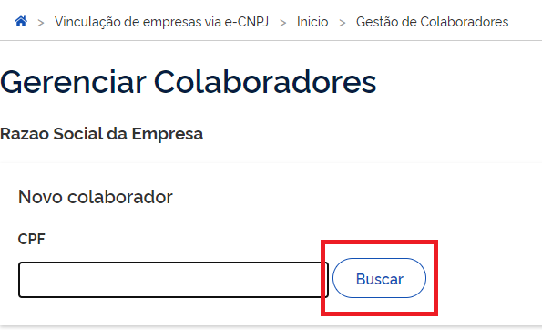
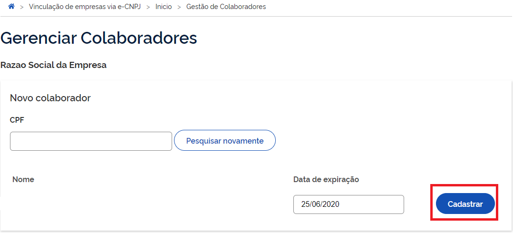

Cadastro de Colaborador do CNPJ
=================================

A Conta gov.br permite o cadastramento de pessoas que não pertencem diretamente a empresa. Esse cadastro ocorre pela indicação de colaboradores. 

**Atenção:** 

1. O cidadão que realizará o cadastro do colaborador deverá ter cadastrado como Representante do CNPJ, conforme os passos presentes para `Cadastro do CNPJ`_.
2. O colaborador deverá ter cadastro no Login Único
3. O dono do certificado digital de pessoal jurídica não poderá ser cadastrado como colaborador da própria empresa.

Para realizar o cadastramento de colaboradores, favor seguir os passos:

1. Cidadão aciona o Certificado Digital de Pessoa Jurídica ao computador (Tipo A1 - máquina - ou Tipo A3 - Token).

2. Selecione opção **Certificado Digital** na tela inicial do https://acesso.gov.br.

.. figure:: _images/tela_inicial_autenticacao_certificado_marcado_govbr2versao.jpg
   :align: center
   :alt: 

3. Siga os procedimentos específicos do tipo de Certificado Digital selecionado para digitar senha e continuar o processo.   

4. Selecione menu **Vincular Empresas via e-CNPJ**, link **Gerenciar Vínculos com Empresas**.

.. figure:: _images/tela_inicial_vincular_empresas_via_ecnpj_novo.jpg
    :align: center
    :alt:

5. Clica no nome da empresa deseja cadastrar os colaboradores. 	

.. figure:: _images/tela_selecionar_empresa_cadastrar_colaboradores.jpg	
    :align: center
    :alt:
	
6. Digita o CPF que deseja vincular ao CNPJ (CPF deverá estar cadastrado na Conta gov.br). Clica no botão **Buscar**

7. Cidadão digita data de expiração que CPF representará o CNPJ (A data de expiração da atuação do colaborador deverá ser até data de validade do certificado digital de pessoa jurídica responsável pelo cadastro do CNPJ. O sistema verificará informação para permitir o colaborador). Clica no botão **Cadastrar**

	
.. |site externo| image:: _images/site-ext.gif
.. _`Cadastro do CNPJ`: comocadastrarCNPJnologinunico.html
            