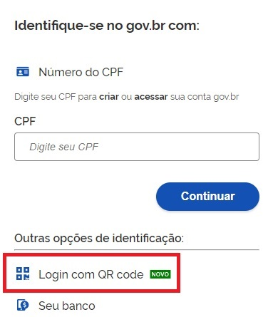
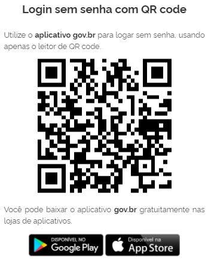
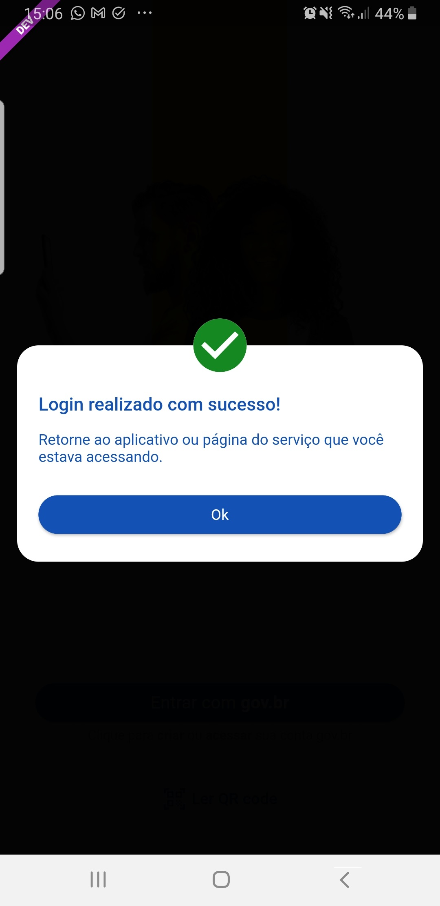

Como Acessar Conta gov.br com Aplicativo gov.br?
================================================

1. Acesse tela inicial do Login Único https://acesso.gov.br e clique no link **Login com QR Code**

2. O QR-CODE para criação da conta será apresentado em tela.    
   

3. Abra o aplicativo gov.br e clique no botão **Ler QR Code**

.. image:: _images/tela_inicial_meugov_botao_qr_code_govbr2versao.jpg
   :align: center
   :height: 770 px
   :width: 400 px
   :alt:   

4. Aponte o celular para tela do computador com intuito de ler o QR-CODE   

.. image:: _images/tela_leitura_qr_code_aplicativo_govbr_govbr2versao.jpg
   :align: center
   :height: 770 px
   :width: 400 px
   :alt:     

5. Clique no botão **OK** para voltar ao computador e acessar conta gov.br.

 
.. |site externo| image:: _images/site-ext.gif
            
