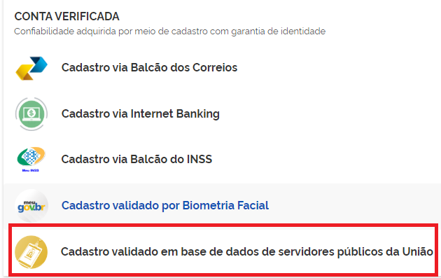
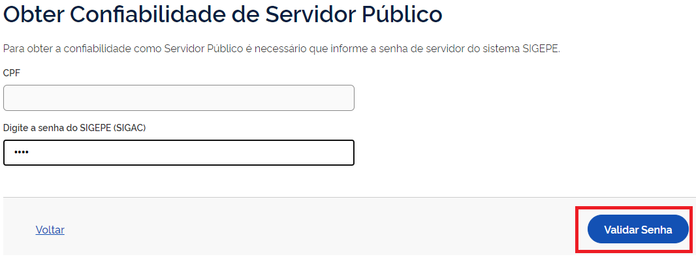

Como Atribuir o Selo Cadastro Básico com Validação em Base de Dados de Servidores Públicos da União
===================================================================================================

1. Digite o CPF na tela inicial do https://acesso.gov.br e clique no botão **Continuar**.

.. figure:: _images/telainicialcombotaoavancargovbr_govbr2versao.jpg
   :align: center
   :alt: 

2. Digita a senha e clica no botão **Entrar**.

.. figure:: _images/tela_login_botao_entrar_destacado_novogovbr.jpg
    :align: center
    :alt:

3. Cidadão deve clicar no menu **Privacidade** e link **Gerenciar lista de selos de confiabilidade**.  

.. figure:: _images/tela_area_cidadao_selecao_selos.jpg
    :align: center
    :alt: 	
	
4. Selecionar o selo **Cadastro validado em base de dados de servidores públicos da União**

	
5. Cidadão, servidor público da Únião, deve digitar senha cadastrada no Sistema de Gestão de Acesso `SIGAC/SIGEPE`_ |site externo|. Clica no botão **Validar Senha**

	
5. Cidadão adquire **Selo Cadastro Básico com Validação em Base de Dados de Servidores Públicos da União**. 

.. |site externo| image:: _images/site-ext.gif
.. _`LEI Nº 13.444, DE 11 DE MAIO DE 2017`: http://www.planalto.gov.br/ccivil_03/_ato2015-2018/2017/lei/l13444.htm
.. _`SIGAC/SIGEPE` : https://sso.gestaodeacesso.planejamento.gov.br/cassso/login