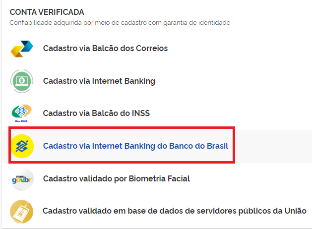
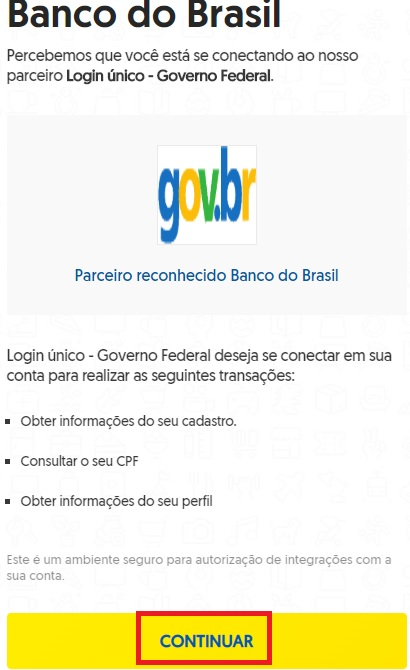
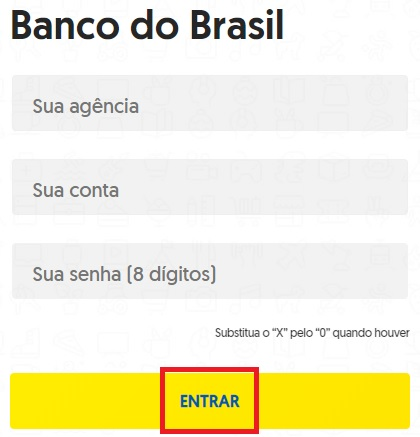
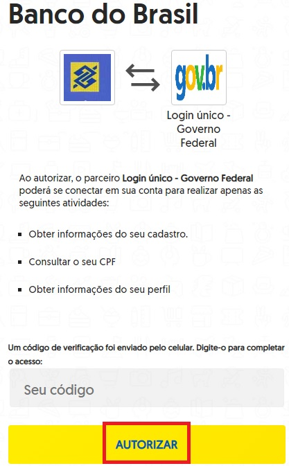

Como Atribuir o Selo Cadastro via Internet Banking do Banco do Brasil
=====================================================================

1. Digite o CPF na tela inicial do https://acesso.gov.br e clique no botão **Avançar**.

.. figure:: _images/telainicialcombotaoproximagovbr_novagovbr.jpg
   :align: center
   :alt: 

2. Digita a senha e clica no botão **Entrar**.

.. figure:: _images/tela_login_botao_entrar_destacado_novogovbr.jpg
    :align: center
    :alt:

3. Cidadão deve clicar no menu **Privacidade** e link **Gerenciar lista de selos de confiabilidade**.  

.. figure:: _images/tela_area_cidadao_selecao_selos.jpg
    :align: center
    :alt: 	
	
4. Selecionar o selo **Selo Cadastro via Internet Banking do Banco do Brasil**

5. Clique no botão **Continuar**.

   
6. Digite o número de agência, conta-corrente, senha de 8 digitos. Clique no botão **Entrar**.

    
7. Digite o código de autorização recebido no aplicativo do Banco do Brasil. Clique no botão **Autorizar**.

	
8. Cidadão adquire **Selo Cadastro via Internet Banking do Banco do Brasil**. 

.. |site externo| image:: _images/site-ext.gif
.. _`LEI Nº 13.444, DE 11 DE MAIO DE 2017`: http://www.planalto.gov.br/ccivil_03/_ato2015-2018/2017/lei/l13444.htm
.. _`SIGAC/SIGEPE` : https://sso.gestaodeacesso.planejamento.gov.br/cassso/login