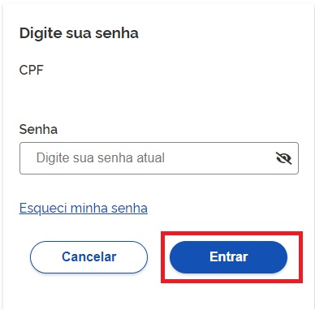
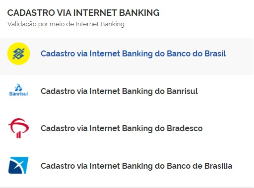
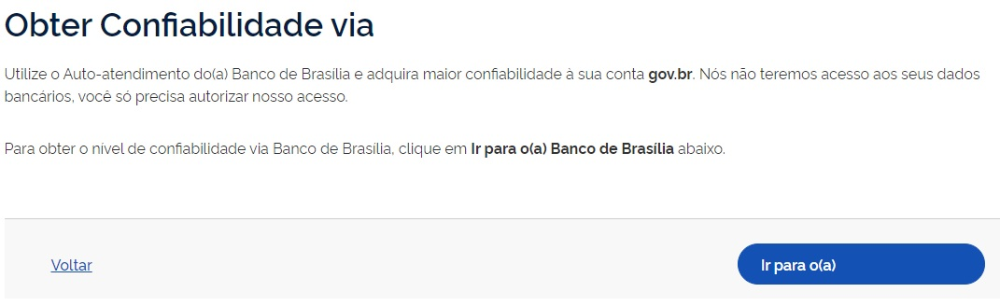

Como Atribuir o Selo de Cada Banco Credenciado
===============================================

1. Digite o CPF na tela inicial do https://acesso.gov.br e clique no botão **Continuar**.

.. figure:: _images/telainicialcombotaoavancargovbr_govbr2versao.jpg
   :align: center
   :alt: 

2. Digita a senha e clica no botão **Entrar**.

3. Cidadão deve clicar no menu **Privacidade** e link **Gerenciar lista de selos de confiabilidade**.  

.. figure:: _images/tela_area_cidadao_selecao_selos.jpg
    :align: center
    :alt: 	
	
4. Selecionar o selo do banco credenciado.

5. Clique no botão **Ir para** do banco credenciado desejado.

   
6. Siga os procedimentos de cada banco credenciado.

8. Cidadão adquire **Selo do Banco Credenciado Desejado**. 

.. |site externo| image:: _images/site-ext.gif
.. _`LEI Nº 13.444, DE 11 DE MAIO DE 2017`: http://www.planalto.gov.br/ccivil_03/_ato2015-2018/2017/lei/l13444.htm
.. _`SIGAC/SIGEPE` : https://sso.gestaodeacesso.planejamento.gov.br/cassso/login