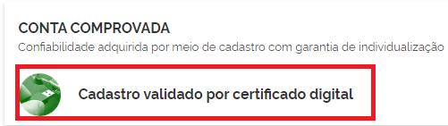
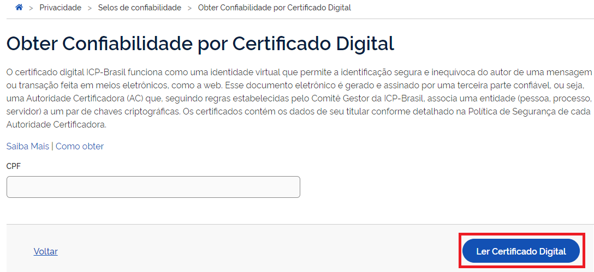

Como Atribuir o Selo Certificado Digital de Pessoa Física
=========================================================

1. Digite o CPF na tela inicial do https://acesso.gov.br e clique no botão **Continuar**.

.. image:: _images/telainicialcombotaoavancargovbr_govbr2versao.jpg
   :align: center
   :alt: 

2. Digita a senha e clica no botão **Entrar**.

.. image:: _images/tela_login_botao_entrar_destacado_novogovbr.jpg
    :align: center
    :alt:

3. Cidadão deve clicar no menu **Privacidade** e link **Gerenciar lista de selos de confiabilidade**.  

.. image:: _images/tela_area_cidadao_selecao_selos.jpg
    :align: center
    :alt: 	
	
4. Selecionar o selo **Cadastro validado por certificado digital**

5. Cidadão aciona o Certificado Digital de Pessoa Fisíca ao computador (Tipo A1 - máquina - ou Tipo A3 - Token). Clica no botão **Adquirir Confiabilidade com Certificado Digital**

	
6. Cidadão adquire **Selo de Certificado Digital de Pessoa Física**. 

.. |site externo| image:: _images/site-ext.gif
.. _`LEI Nº 13.444, DE 11 DE MAIO DE 2017`: http://www.planalto.gov.br/ccivil_03/_ato2015-2018/2017/lei/l13444.htm
.. _`Meu INSS` : https://meu.inss.gov.br/
