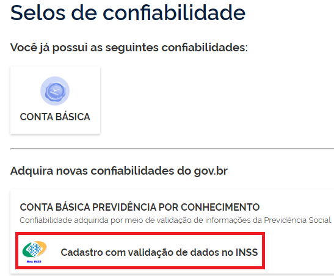

Como Atribuir o Selo Cadastro Básico com Validação de Dados Previdênciarios
===========================================================================

1. Digite o CPF na tela inicial do https://acesso.gov.br e clique no botão **Continuar**.

.. figure:: _images/telainicialcombotaoavancargovbr_govbr2versao.jpg
   :align: center
   :alt: 

2. Digita a senha e clica no botão **Entrar**.

.. figure:: _images/tela_inicial_login_unico_entrar_novogovbr.jpg
    :align: center
    :alt: 

3. Cidadão deve clicar no menu **Privacidade** e link **Gerenciar lista de selos de confiabilidade**.  

.. figure:: _images/tela_area_cidadao_selecao_selos.jpg
    :align: center
    :alt: 

4. Selecionar o selo **Cadastro com validação de dados no INSS**

	
5. Cidadão deve responder todas perguntas referente ao cadastro presente no INSS / Ministério da Economia. Clica no botão **Continuar** para cada pergunta até finalizar.

.. figure:: _images/tela_perguntas_inss.jpg
    :align: center
    :alt:
	
5. Cidadão adquire **Selo Cadastro no INSS**. 

.. |site externo| image:: _images/site-ext.gif
.. _`LEI Nº 13.444, DE 11 DE MAIO DE 2017`: http://www.planalto.gov.br/ccivil_03/_ato2015-2018/2017/lei/l13444.htm
.. _`Meu INSS` : https://meu.inss.gov.br/
