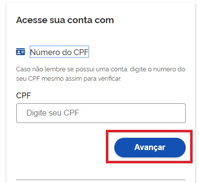
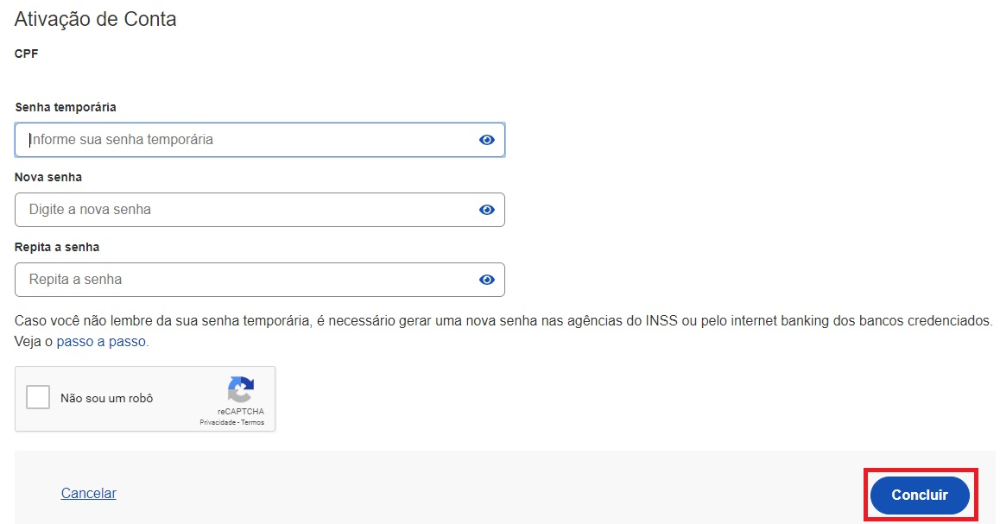

Como Atribuir o Selo Balcão Presencial (CORREIOS)
=================================================

1. Cidadão deve ir ao posto dos CORREIOS relacionados:

- AC Ceilândia: Endereço: CNN 1 Bloco F Térreo - Ceilândia - DF
- AC Planaltina: Endereço: SHD WL 2 Conjunto D Área Especial SN LO - Planaltina - DF
- AC Santa Maria: Endereço: CL 115 Lote E Avenida Alagados - Santa Maria - DF

2. Atendente do CORREIOS cadastra **senha temporária** para acesso ao Login Único e entrega ao cidadão

3. Digite o CPF na tela inicial do https://acesso.gov.br e clique no botão **Avançar**.

	
4. Cidadão digita **senha temporária**, **nova senha**, **repete nova senha**. Clica no botão **Concluir**

5. Cidadão adquire **Selo Cadastro via Balcão dos Correios**.

.. |site externo| image:: _images/site-ext.gif
.. _`LEI Nº 13.444, DE 11 DE MAIO DE 2017`: http://www.planalto.gov.br/ccivil_03/_ato2015-2018/2017/lei/l13444.htm
.. _`Meu INSS` : https://meu.inss.gov.br/
