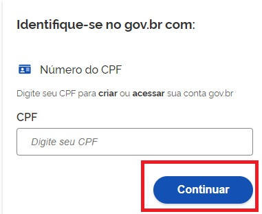
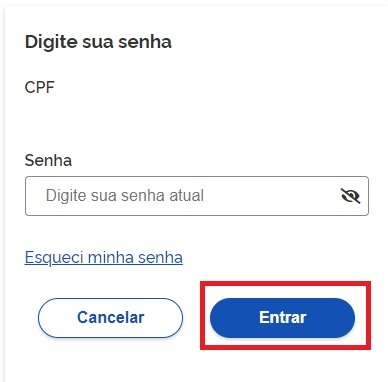
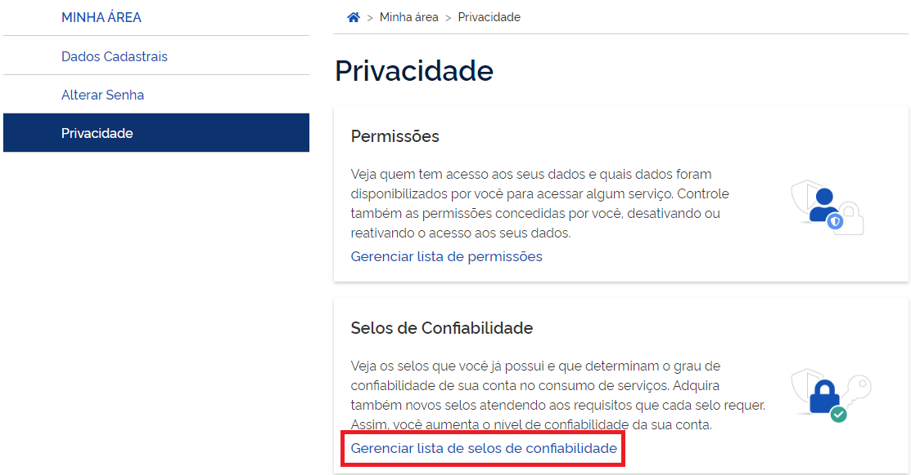
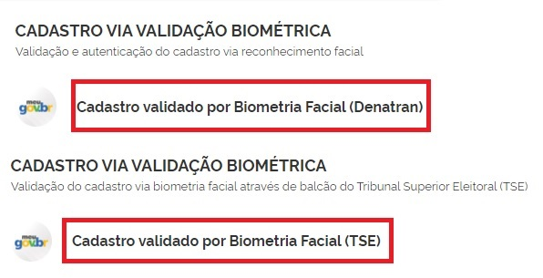
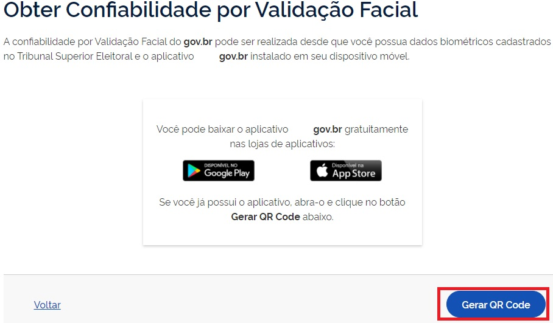
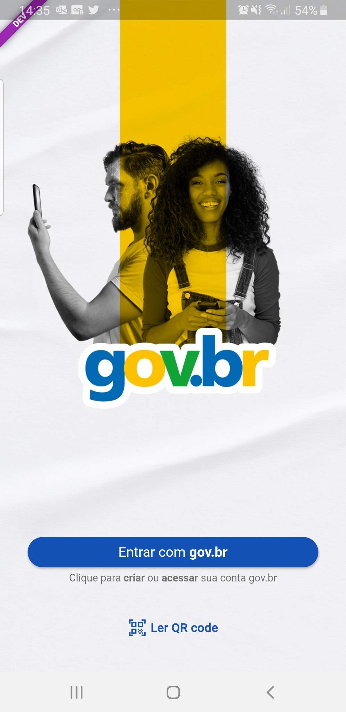
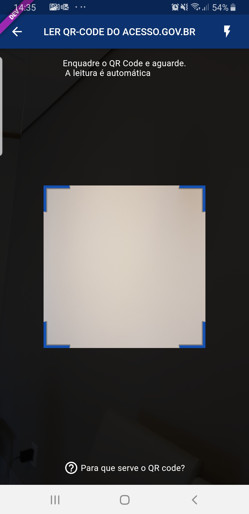
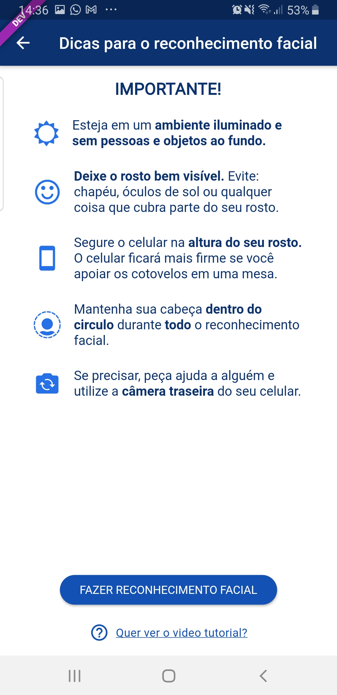
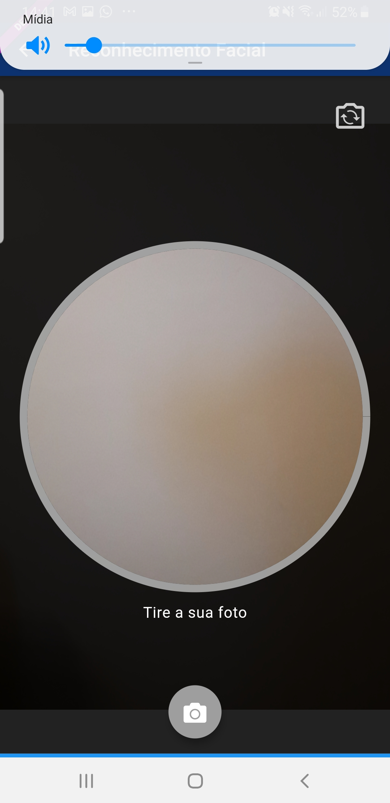
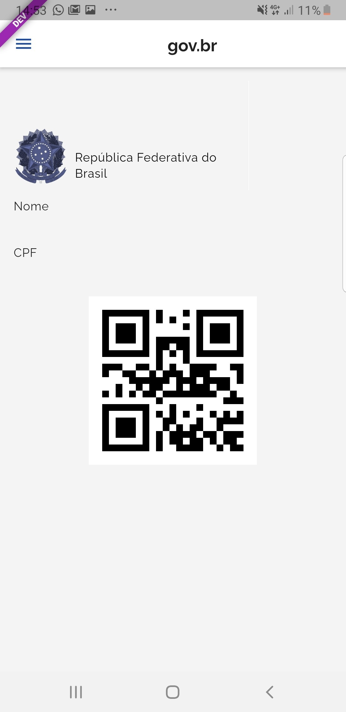

Como Atribuir o Selo Validação Facial
=====================================

1. Digite o CPF na tela inicial do https://acesso.gov.br e clique no botão **Continuar**.

2. Digita a senha e clica no botão **Entrar**.

3. Cidadão deve clicar no menu **Privacidade** e link **Gerenciar lista de selos de confiabilidade**.  

	
4. Selecionar o selo **Cadastro Valido por Biometria Facial (TSE)** ou **Cadastro Valido por Biometria Facial (Denatran)**

5. Clique no botão **Gerar QR CODE**

	
- Abra o aplicativo gov.br e clique no botão **Ler QR Code**

- Aponte o celular para tela do computador com intuito de ler o QR-CODE   

   
- Clique no botão **Fazer Reconhecimento Facial**.

   
- Posicionar o rosto de frente para câmera celular, clique no **botão azul com figura de câmera** e siga as orientações de piscar os olhos e sorrir até sistema validar as informações.
   

   
- Clique no botão **OK** e continue o processo no computador

.. figure:: _images/tela_confirmacao_validacao_govbr_continuar_computador_govbr2versao.jpg
   :align: center
   :height: 770 px
   :width: 400 px
   :alt:   

9. Cidadão adquire **Selo Validação Facial**

   
.. |site externo| image:: _images/site-ext.gif
.. _`Orientações para baixar o aplicativo Meu GOV.BR` : oqueemeugovbrmobile.html