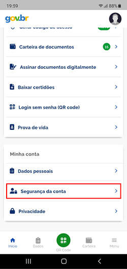
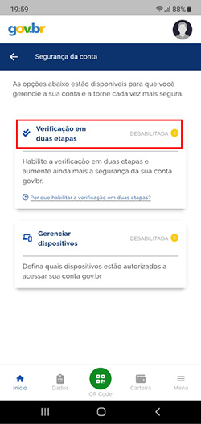
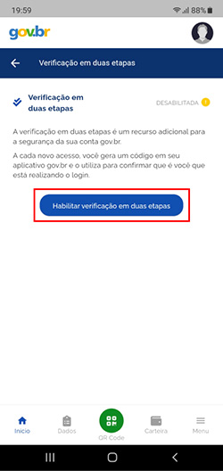
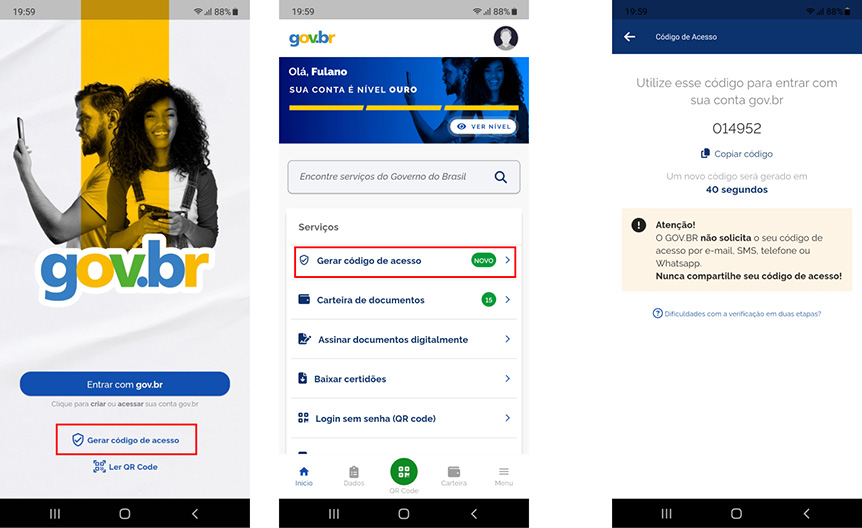

Como habilitar a verificação em duas etapas?
=========================================================================

.. admonition:: Importante:

   A verificação em duas etapas só poderá ser desabilitada usando o **aplicativo gov.br**.

1. Baixe e acesse o `aplicativo gov.br`_ no seu celular.

2. Clique em **Segurança da conta**.

3. Clique em **Verificação em duas etapas**. 

4. Clique no botão **Habilitar verificação em duas etapas**.

Depois de habilitar a verificação em duas etapas, estará disponível na tela de login e na tela principal do seu aplicativo gov.br a opção **Gerar código de acesso**. Clique nesta opção para gerar o código e informá-lo no processo de login.

.. _`aplicativo gov.br`: https://www.gov.br/governodigital/pt-br/conta-gov-br/baixar-app-gov.br 
.. |site externo| image:: _images/site-ext.gif
