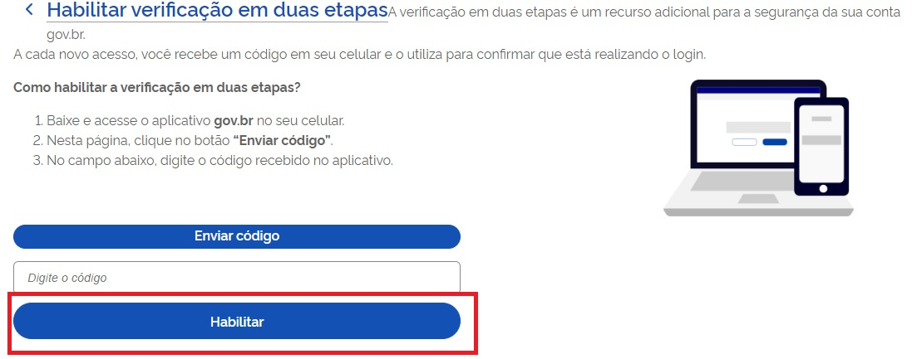

Como ativar autenticação de dois fatores?
=========================================================================

**A instalação do aplicativo govbr no celular é necessaria para ativar autenticação de dois fatores.**

1. Digite o CPF na tela inicial do https://acesso.gov.br e clique no botão **Continuar**.

.. figure:: _images/telainicialcombotaoavancargovbr_govbr2versao.jpg
   :align: center
   :alt: 

2. Digita a senha e clica no botão **Entrar**.

.. figure:: _images/tela_login_botao_entrar_destacado_novogovbr.jpg
    :align: center
    :alt:

3. Cidadão deve clicar no cart **Segurança da Conta**.  

.. figure:: _images/cardseguraca2fator.jpg
    :align: center
    :alt:

4. Cidadão deve clicar no cart **Verificação em duas etapas**.  

.. figure:: _images/cardverificacao2etapas.jpg
    :align: center
    :alt:

5. Cidadão deve digitar o código enviado no aplicativo gov.br e clicar no botão **Habilitar**.  

6. Verificação em duas etapas estará habilitada. Agora todas as vezes que você digitar sua senha gov.br, será necessário digitar o código de segurança mostrado no seu aplicativo Meu GOV.BR.

.. _`passos para configurar o segundo fator na conta gov.br`: https://www.base64decode.org/ 
.. |site externo| image:: _images/site-ext.gif
