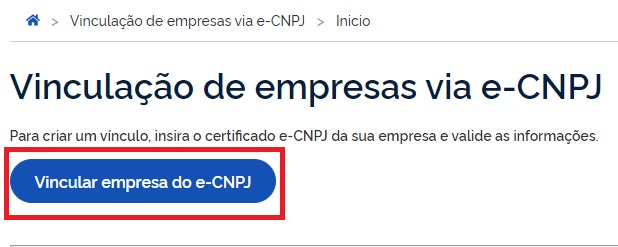
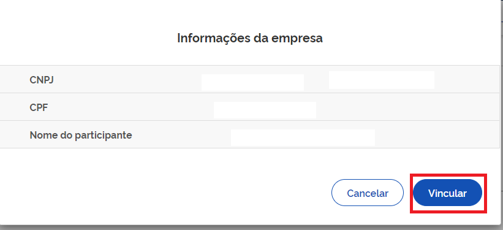

Como Cadastrar CNPJ?
====================

Para cadastrar o CNPJ:

1. Cidadão aciona o Certificado Digital de Pessoa Jurídica ao computador (Tipo A1 - máquina - ou Tipo A3 - Token ou Certificado em Nuvem).

2. Selecione opção **Certificado Digital** ou **Certificado Digital em Nuvem** na tela inicial do https://acesso.gov.br.

.. figure:: _images/tela_inicial_autenticacao_certificado_marcado_govbr2versao.jpg
   :align: center
   :alt: 

3. Siga os procedimentos específicos do tipo de Certificado Digital selecionado para digitar senha e continuar o processo.   

4. Selecione menu **Vincular Empresas via e-CNPJ**, link **Gerenciar Vínculos com Empresas**.

.. figure:: _images/tela_inicial_vincular_empresas_via_ecnpj_novo.jpg
    :align: center
    :alt:
	
5. Clicar botão **Vincular empresa do e-CNPJ**

 

6. Cidadão confere as informações presentes no Certificado Digital de Pessoa Jurídica. Clica no botão **Vincular**

.. |site externo| image:: _images/site-ext.gif
            