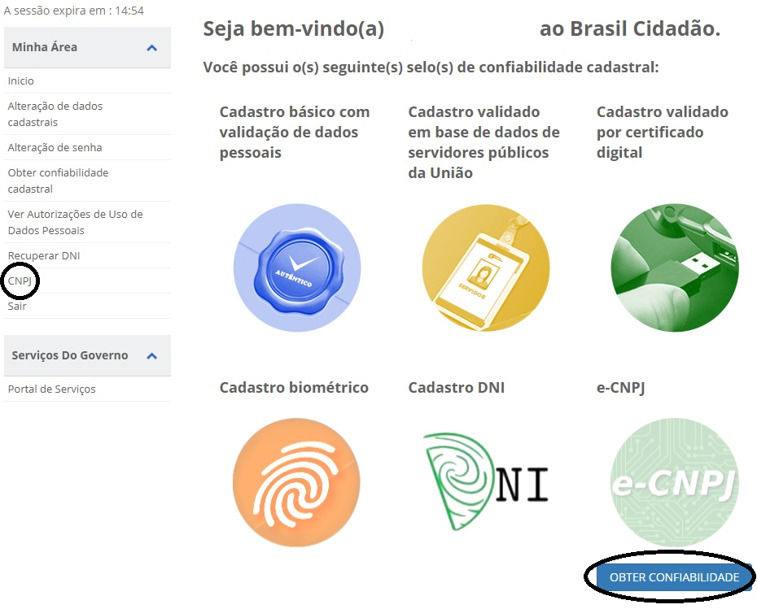
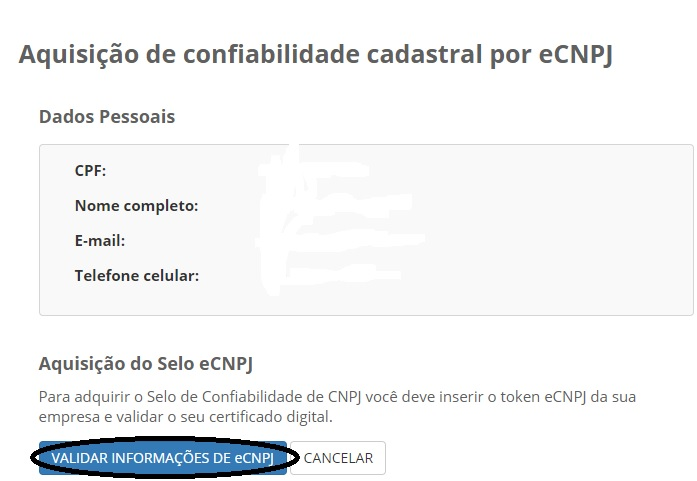

Como Cadastrar CNPJ no Login Único?
==================================

Para cadastrar o CNPJ no Login Único:

- Acesse o item de menu "CNPJ" ou Botão "Obter Confiabilidade abaixo" do selo e-CNPJ

  
- Insira o Certificado Digital Pessoal Jurídica do CNPJ que deseja cadastrar e clique no botão "Validar Informações do eCNPJ"   

  
Lembrando que o certificado digital de pessoa jurídica deve ser do tipo A3, compatível com ICP-BRASIL, para cadastrar o CNPJ da pessoa jurídica

**Possíveis Palavras/Termos (Utilizado para busca no chatbot)**

- pessoa jurídica, login PJ/Pessoa Jurídica, login empresas, e-cnpj
- quero ter um login para PJ/Pessoa Jurídica;
- PJ/Pessoa jurídica tem login e senha
- existe esse serviço para PJ/Pessoa Jurídica
- tem serviço para PJ/Pessoa Jurídica
- PJ/Pessoa Jurídica pode usar o login único/Brasil Cidadão
- Tem esse serviço para PJ/Pessoa Jurídica
   
.. |site externo| image:: _images/site-ext.gif
            