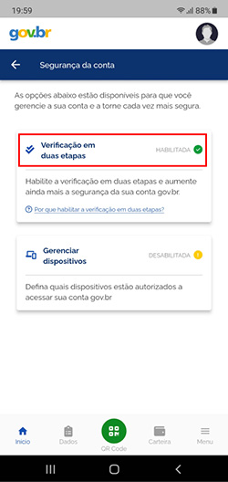
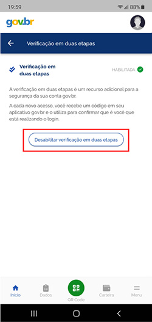

Como desabilitar a verificação em duas etapas?
=========================================================================

.. admonition:: Importante:

   A verificação em duas etapas só poderá ser desabilitada usando o **aplicativo gov.br**.

1. Acesse o aplicativo gov.br e clique em **Segurança da conta**.

2. Clique em **Verificação em duas etapas**.

3. Clique no botão **Desabilitar verificação em duas etapas**.

.. |site externo| image:: _images/site-ext.gif
.. _`recuperar sua conta por Validação Facial no aplicativo Meu gov.br`: formarrecuperarconta.html#recuperar-conta-por-meio-do-aplicativo-meu-gov-br