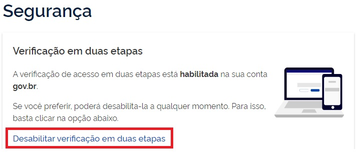

Como retirar autenticação de dois fatores?
=========================================================================

1. Digite o CPF na tela inicial do https://acesso.gov.br e clique no botão **Continuar**.

.. figure:: _images/telainicialcombotaoavancargovbr_govbr2versao.jpg
   :align: center
   :alt: 

2. Digita a senha e clica no botão **Entrar**.

.. figure:: _images/tela_login_botao_entrar_destacado_novogovbr.jpg
    :align: center
    :alt:

3. Cidadão deve clicar no menu **Segurança** e link **Desabilitar verificação em duas etapas**..  

4. Verificação em duas etapas estará retirada.

Atenção: Se por algum motivo você não tiver mais acesso ao seu aplicativo Meu gov.br, será necessário `recuperar sua conta por Validação Facial no aplicativo Meu gov.br`_.
 
.. |site externo| image:: _images/site-ext.gif
.. _`recuperar sua conta por Validação Facial no aplicativo Meu gov.br`: formarrecuperarconta.html#recuperar-conta-por-meio-do-aplicativo-meu-gov-br