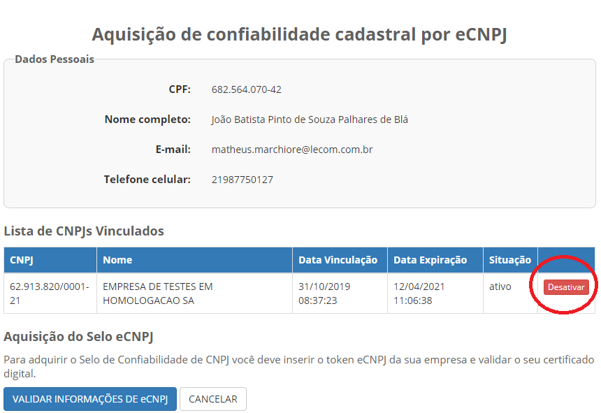
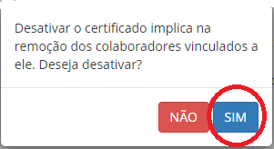
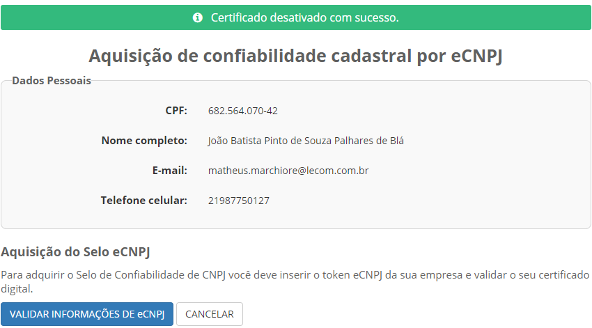

Como Atualizar CNPJ no Login Único?
==================================

Para atualizar o CNPJ no Login Único:

- Acesse o item de menu **CNPJ** ou Botão **Obter Confiabilidade abaixo" do selo e-CNPJ**

.. figure:: _images/telainicialcomocadastrarCNPJ.jpg
   :align: center
   :alt: Página Inicial do Login único com destaque as funcionalidades para adquirir o Selo eCNPJ. Ocorre pelo item de Menu CNPJ ou Botão Obter Confiabilidade abaixo do selo eCNPJ  
  
- Clique no botão **Desativar**   

- Aparecerá tela com a pergunta **Desativar o certificado implica na remoção do colaboradores vinculados a ele. Deseja desativar?**. Entendido a pegunta, clique no botão **Sim**.

- Aparecerá tela com a confirmação da desativação do CNPJ antigo

- Após isso, realizar os procedimentos de `Como Cadastrar CNPJ no Login Único?`_ para atualização do CNPJ
   
.. |site externo| image:: _images/site-ext.gif
.. _`Como Cadastrar CNPJ no Login Único?` : comocadastrarCNPJnologinunico.html           