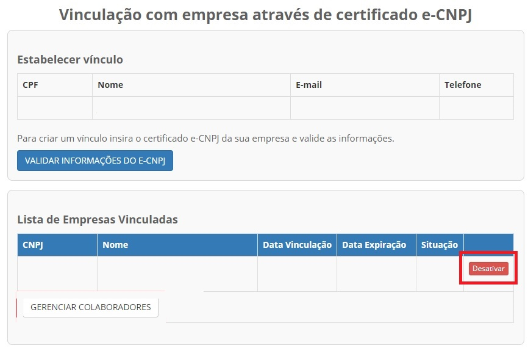
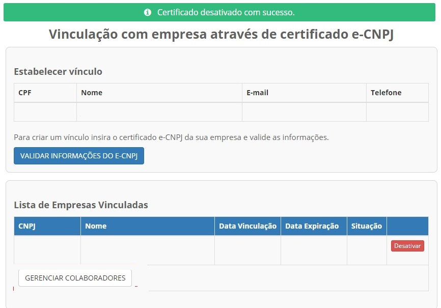

Como Atualizar CNPJ no Login Único?
==================================

Para atualizar o CNPJ no Login Único:

- Cidadão deve clicar o item do menu **CNPJ**.  

.. figure:: _images/tela_selecao_inicio_processo_colaborador.jpg
    :align: center
    :alt: 

- Localiza o CNPJ deseja alterar. Clique no botão **Desativar**   

- Aparecerá tela com a pergunta **Desativar o certificado implica na remoção do colaboradores vinculados a ele. Deseja desativar?**. Entendido a pegunta, clique no botão **Sim**.

.. figure:: _images/tela_confirmar_exclusao_colaboradores.png
   :align: center
   :alt: 

- Aparecerá tela com a confirmação da desativação do CNPJ antigo

- Após isso, realizar os procedimentos de `Como Cadastrar CNPJ no Login Único?`_ para atualização do CNPJ

.. |site externo| image:: _images/site-ext.gif
.. _`Como Cadastrar CNPJ no Login Único?` : comocadastrarCNPJnologinunico.html           