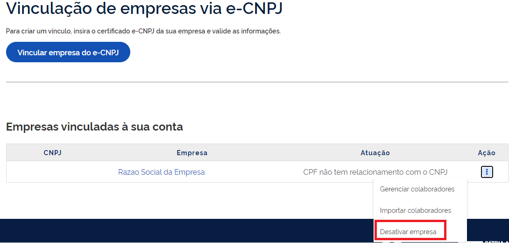
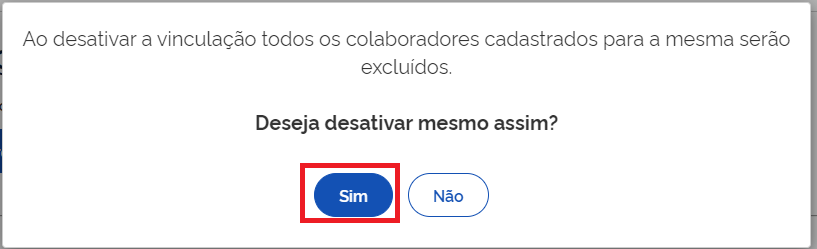

Como Atualizar CNPJ?
====================

Para atualizar o CNPJ:

1. Cidadão aciona o Certificado Digital de Pessoa Jurídica ao computador (Tipo A1 - máquina - ou Tipo A3 - Token).

2. Selecione opção **Certificado Digital** ou **Certificado Digital em Nuvem** na tela inicial do https://acesso.gov.br.

.. figure:: _images/tela_inicial_autenticacao_certificado_marcado_govbr2versao.jpg
   :align: center
   :alt: 

3. Siga os procedimentos específicos do tipo de Certificado Digital selecionado para digitar senha e continuar o processo.   

4. Selecione menu **Vincular Empresas via e-CNPJ**, link **Gerenciar Vínculos com Empresas**.

.. figure:: _images/tela_inicial_vincular_empresas_via_ecnpj_novo.jpg
    :align: center
    :alt:

5. Localiza o CNPJ deseja alterar. Clique no **botão com imagem de 3 pontos na vertical** e selecione opção **Desativar Empresa**   

6. Aparecerá tela com a pergunta **Ao desativar a vinculação todos os colaboradores cadastrados para a mesma serão excluídos.Deseja desativar mesmo assim?**. Entendido a pegunta, clique no botão **Sim**.

7. Após isso, realizar os procedimentos de `Como Cadastrar CNPJ?`_ para atualização do CNPJ

.. |site externo| image:: _images/site-ext.gif
.. _`Como Cadastrar CNPJ?` : comocadastrarCNPJnologinunico.html           