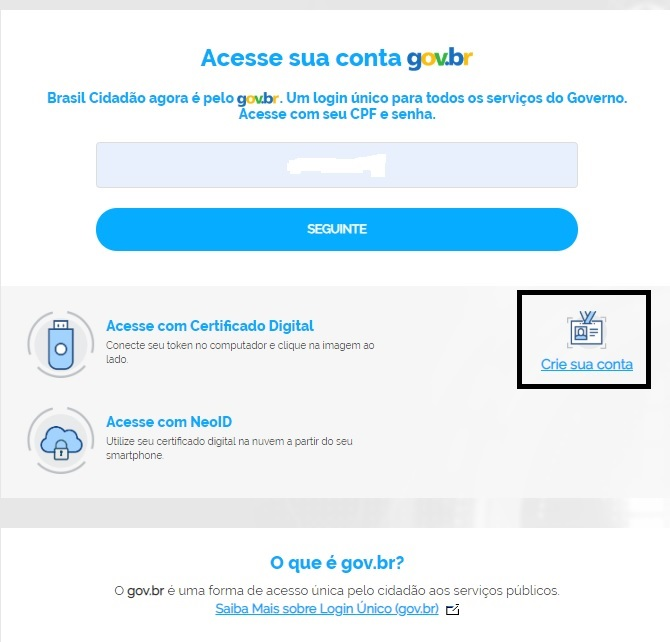
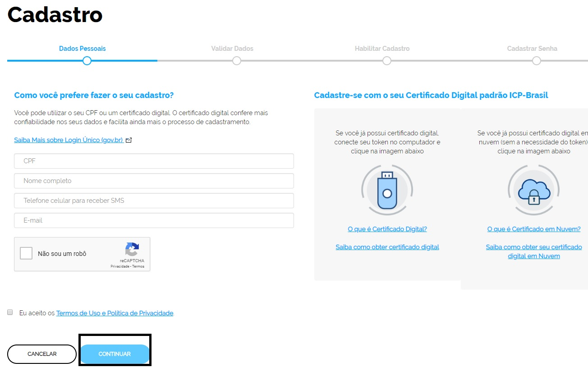
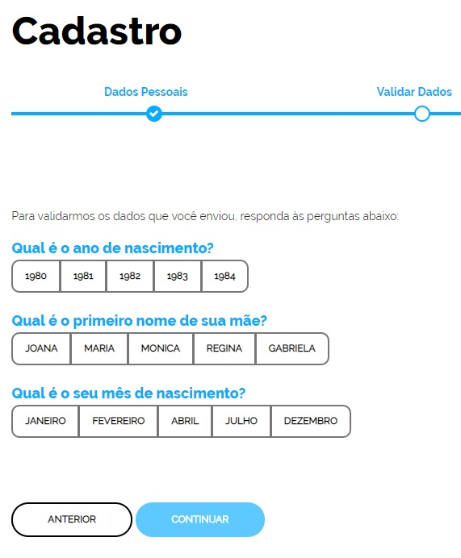
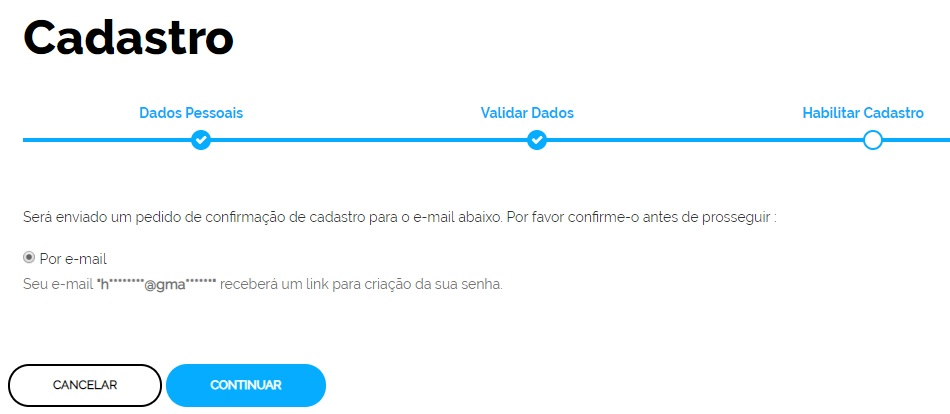

Conta de acesso
===============

Para criar uma conta de acesso, clique no link `Crie sua conta`_ |site externo| e siga os passos:

1. Tenha em mãos um documento de identidade, número do CPF, nome completo, e-mail e número do celular e clique no botão continuar

2. Responda as perguntas relacionadas às suas informações pessoais.

3. Após a verificação das respostas, a Plataforma enviará uma mensagem para email ou para número do celular. A opção SMS só estará ativa se o número de celular tiver sido informado, conforme passo 1.

4. Caso tenha escolhido a opção do email, abra o seu e-mail e clique no link enviado (confira na caixa de spam caso não esteja na caixa de entrada)

.. figure:: _images/emailcomlinkparasenha.jpg
   :align: center
   :alt: Texto do email encaminhado ao cidadão para realizar o cadastramento da conta. O texto do email é "Assunto com gov.br: confirmação do cadastro e texto para indicar a forma de cadastramento com link" 

5. Caso tenha escolhido a opção do SMS, conferir a mensagem recebida no celular informado e digitar o código no campo **Informe o código de validação** e clique no botão **Validar Cadastro**

.. figure:: _images/teladigitarsmsparaconfirmacao.jpg
   :align: center
   :alt: Tela de confirmação do código SMS com os botões Cancelar, Validar Cadastro e Não recebi o SMS
   
6. Definir uma senha e finalizar o cadastro e ativar sua conta.

.. figure:: _images/telacadastramentosenhagovbr.jpg
   :align: center
   :alt: Tela para ativação do cadastro e os campos CPF, SENHA, REPETIR SENHA e os botões CRIAR SENHA ou CANCELAR. 

Caso você tenha um certificado digital pessoa física compatível com a ICP-Brasil, você poderá usá-lo no seu primeiro cadastro començando pelo passo 2.

**Possíveis Palavras/Termos (Utilizado para busca no chatbot)**

- cadastro, primeiro acesso, criação de conta, criação de senha,  primeiro cadastro
- como posso começar
- quero ter meu login único
- o que devo fazer
- como obter
- o que devo ter para ter o login único/conta
- como obter o login único/conta
- quero uma conta/login/cadastro
- fazer cadastro
- cadastro
- Mais quando tento acessar aparece senha e usuario invalido
- Não estou consguindo acessar com meu login e senha
- não tenho  senha  brasil cidadao/Login Único/govbr
- Cadrastar dados pessoais
- Preciso de ajuda com o cadastro
- CPF aparece invalido na plataforma
- CPF está invalido segundo o site 
- cpf esta dando invalido, mesmo após eu utiliza-lo no brasil cidadao/Login Único/govbr e estar correto
- peço pra trocar a senha ai ele diz acrescentar cpf. Quando aperto em criar senha ai ele diz cpf invalido
- 

.. _`Crie sua conta`: https://acesso.gov.br/acesso/#/primeiro-acesso
.. |site externo| image:: _images/site-ext.gif
            