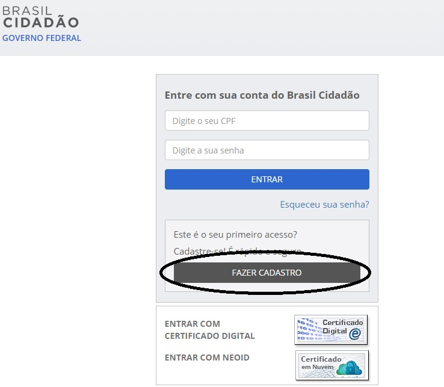
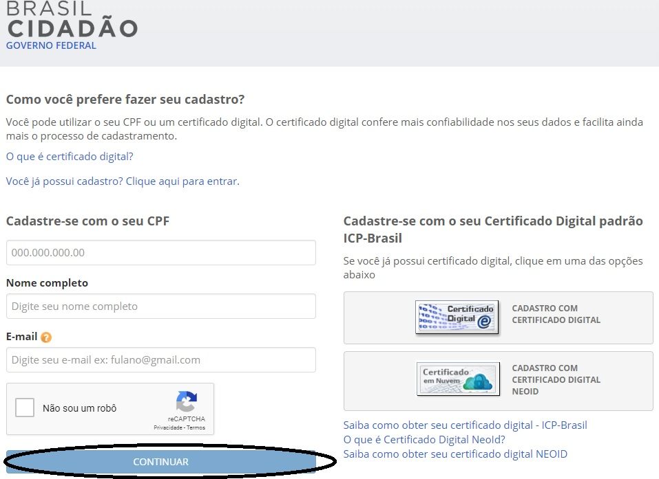
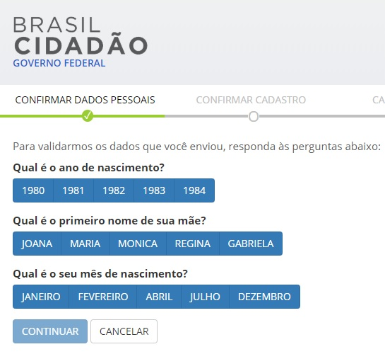
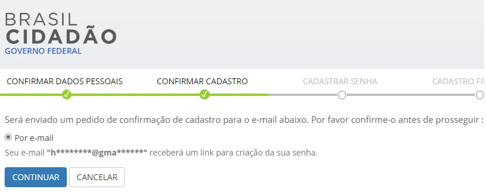

Conta de acesso
===============

Para criar uma conta de acesso, clique no botão `Fazer Cadastro`_ |site externo| e siga os passos:

1. Tenha em mãos um documento de identidade, número do CPF, nome completo, e-mail e clique no botão continuar

2. Responda as perguntas relacionadas às suas informações pessoais.

3. Após a verificação das respostas, a Plataforma enviará uma mensagem  ao seu e-mail.

4. Abra o seu e-mail e clique no link enviado (confira na caixa de spam caso não esteja na caixa de entrada),

.. figure:: _images/emailcomlinkparasenha.jpg
   :align: center
   :alt:

5. Definir uma senha e finalizar o cadastro e ativar sua conta.

.. figure:: _images/telacadastramentosenha.jpg
   :align: center
   :alt:

Caso você tenha um certificado digital compatível pessoa físicacom a ICP-Brasil, você poderá usá-lo no seu primeiro cadastro seguindo començando pelo passo 2.

**Possíveis Palavras/Termos**:

- cadastro, primeiro acesso, criação de conta, criação de senha,  primeiro cadastro
- como posso começar
- quero ter meu login único
- o que devo fazer
- como obter
- o que devo ter para ter o login único/conta
- como obter o login único/conta
- quero uma conta/login/cadastro
- fazer cadastro
- cadastro

.. _`Fazer Cadastro`: https://portal.brasilcidadao.gov.br/servicos-cidadao/acesso/#/primeiro-acesso
.. |site externo| image:: _images/site-ext.gif
            