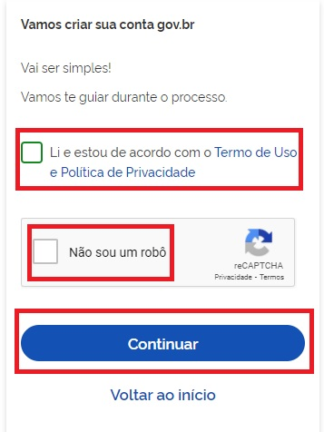
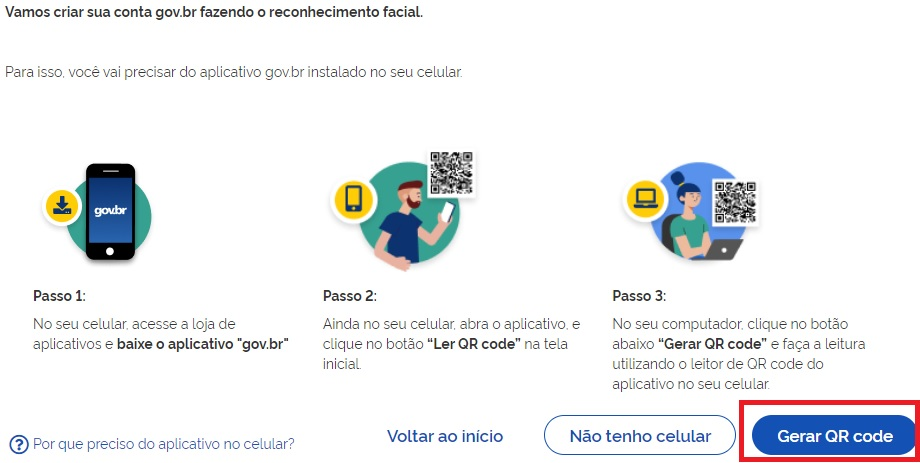
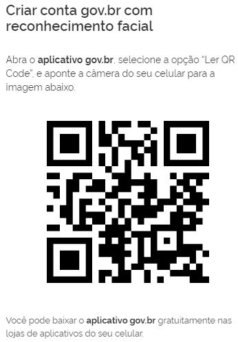
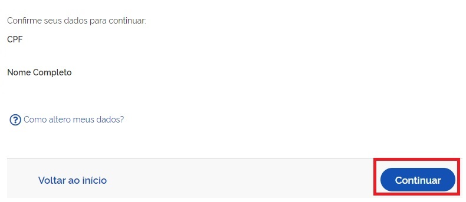
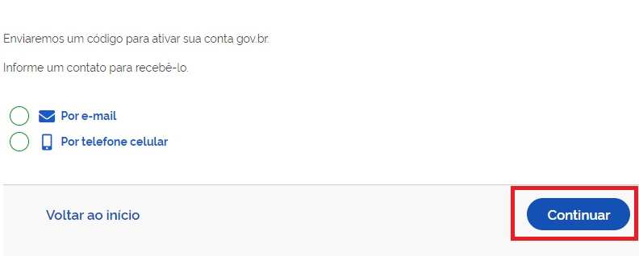
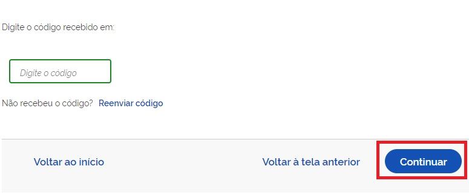
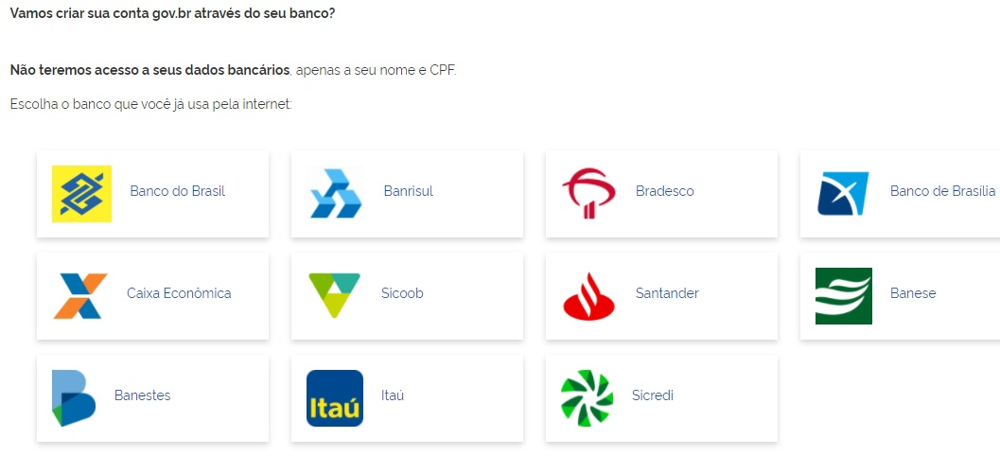
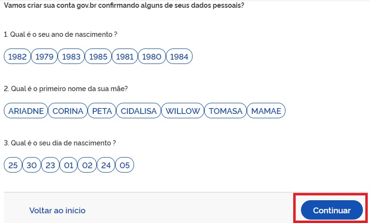

Conta de acesso
===============

Para criar uma conta de acesso, digite o CPF na tela inicial em https://acesso.gov.br e clique no botão **Continuar**.

.. figure:: _images/telainicialcombotaoavancargovbr_govbr2versao.jpg
   :align: center
   :alt: 

   
Selecione as opções de **Termo de Uso**, **Não sou robô** e clique no botão **Continuar**  
   

Existem diversas formas para realizar o cadastro. O autenticador disponibilizará melhor e mais segura forma para realizar o cadastro.   

1. Cadastro por meio do Aplicativo gov.br
--------------------------------------------

- Clique no botão **Gerar QR CODE**

- O QR-CODE para criação da conta será apresentado em tela.    
   

- Abra o aplicativo gov.br e clique no botão **Ler QR Code**

.. figure:: _images/tela_inicial_meugov_botao_qr_code_govbr2versao.jpg
   :align: center
   :height: 770 px
   :width: 400 px
   :alt:   

- Aponte o celular para tela do computador com intuito de ler o QR-CODE   

.. figure:: _images/tela_leitura_qr_code_aplicativo_govbr_govbr2versao.jpg
   :align: center
   :height: 770 px
   :width: 400 px
   :alt:   
   
- Clique no botão **Fazer Reconhecimento Facial**.

.. figure:: _images/tela_instrucoes_reconhecimento_facial_aplicativo_govbr_govbr2versao.jpg
   :align: center
   :height: 770 px
   :width: 400 px
   :alt:
   
- Posicionar o rosto de frente para câmera celular, clique no **botão azul com figura de câmera** e siga as orientações de piscar os olhos e sorrir até sistema validar as informações.
   
.. figure:: _images/tela_inicio_validacao_facial_govbr_mobile_govbr2versao.jpg
   :align: center
   :height: 770 px
   :width: 400 px
   :alt:   
   
- Clique no botão **OK** e continue o processo no computador

.. figure:: _images/tela_confirmacao_validacao_govbr_continuar_computador_govbr2versao.jpg
   :align: center
   :height: 770 px
   :width: 400 px
   :alt:
   
- Confirme as informações de CPF e NOME e clique no botão **Continuar**

- Selecione a opção deseja ativar conta (email ou sms), preenche o conteúdo da opção (conta de email ou telefone celular) e clique no botão **Continuar**.   
   

   
- Digite o código de acesso e clique no botão **Continuar**   
   

- Preencha com senha escolhida e clique no botão **Continuar** para finalizar o cadastro.   
   
.. figure:: _images/tela_criacao_senha_por_computador_govbr2versao.jpg
   :align: center
   :alt:   
    

2. Cadastro por meio dos Bancos Credenciados
-------------------------------------------- 

- Tenha em mãos as informações do banco credenciado deseja utilizar.

- Clique na imagem do banco credenciado desejado para cadastrar a conta.

   
- Siga as orientações do banco credenciado desejado para cadastrar a conta.

- Confirme as informações de CPF e NOME e clique no botão **Continuar**

- Selecione a opção deseja ativar conta (email ou sms), preenche o conteúdo da opção (conta de email ou telefone celular) e clique no botão **Continuar**.   
   

   
- Digite o código de acesso e clique no botão **Continuar**   
   

- Preencha com senha escolhida e clique no botão **Continuar** para finalizar o cadastro.   
   
.. figure:: _images/tela_criacao_senha_por_computador_govbr2versao.jpg
   :align: center
   :alt:   

3. Cadastro por meio do Internet Banking dos bancos conveniados
---------------------------------------------------------------

- Existem alguns bancos conveniados para permitir a criação da conta por meio da geração de uma senha temporária. A senha deverá ser trocada no primeiro acesso. Para isso, acesse o passo a passo de cada banco presente no link `acesse o passo a passo de cada banco`_.

- De posse da senha temporária, retorne tela inicial, digite o CPF e clique no botão **Proxima**. Existem senhas temporárias que precisam de 24h a 48h para ativação pelos bancos.   

.. figure:: _images/telainicialcombotaoavancargovbr_govbr2versao.jpg
   :align: center
   :alt:

- Digite senha temporária, senha definitiva e marque opção **Não sou robô**. Após, clique no botão **Concluir** para criação da conta    

.. figure:: _images/tela_senha_temporaria_novogovbr.jpg
   :align: center
   :alt:   
   
4. Cadastro com as informações básicas do cidadão
--------------------------------------------------

- Responda as perguntas relacionadas às suas informações pessoais. Clique no botão **Continuar**.

- Confirme as informações de CPF e NOME e clique no botão **Continuar**

- Selecione a opção deseja ativar conta (email ou sms), preenche o conteúdo da opção (conta de email ou telefone celular) e clique no botão **Continuar**.   
   

   
- Digite o código de acesso e clique no botão **Continuar**   
   

- Preencha com senha escolhida e clique no botão **Continuar** para finalizar o cadastro.   
   
.. figure:: _images/tela_criacao_senha_por_computador_govbr2versao.jpg
   :align: center
   :alt:   
  
.. _`acesse o passo a passo de cada banco` : comocadastrarsenhatemporariadosbancosconveniados.html   
.. |site externo| image:: _images/site-ext.gif
            