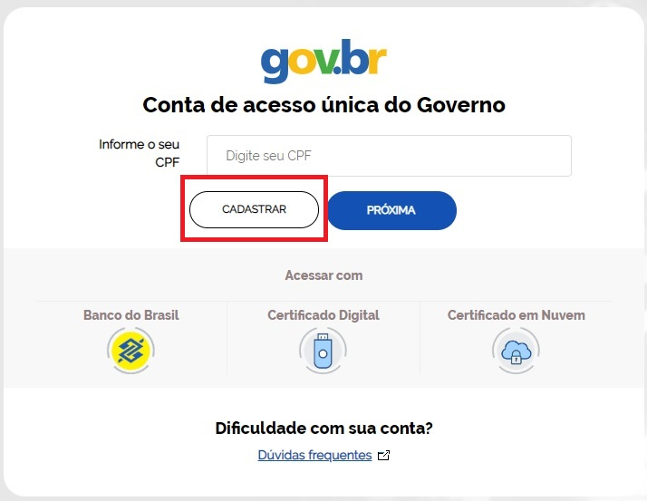
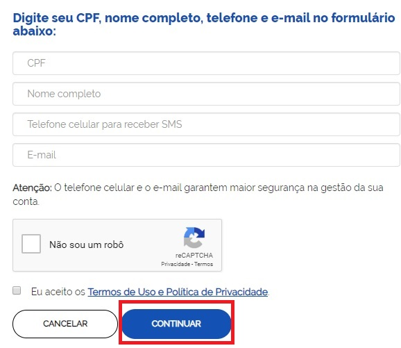
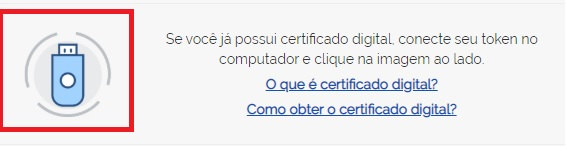
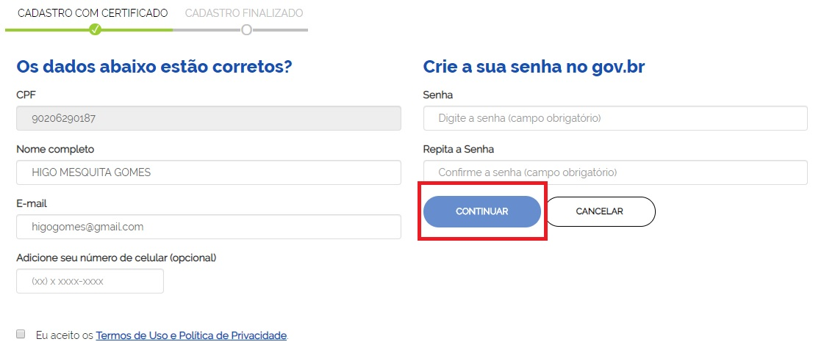
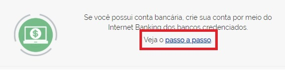
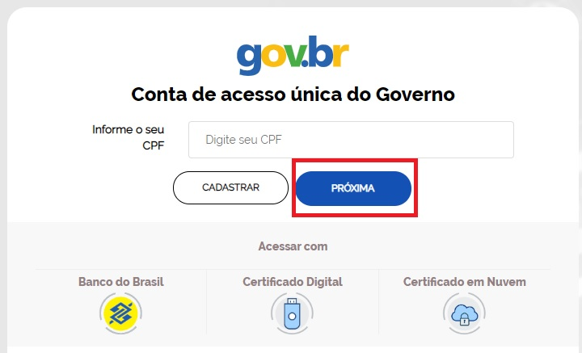
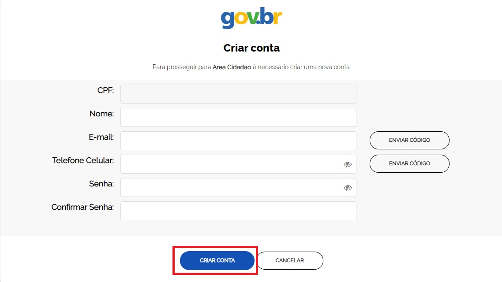
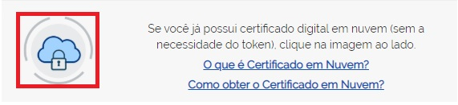

Conta de acesso
===============

Para criar uma conta de acesso, clique no botão **Cadastrar** na tela inicial:

Existem diversas formas para realizar o cadastro no Login Único.

1. Cadastro com as informações básicas do cidadão
--------------------------------------------------

- Tenha em mãos um documento de identidade, número do CPF, nome completo, e-mail e número do celular e clique no botão **Continuar**

   
- Responda as perguntas relacionadas às suas informações pessoais.

.. figure:: _images/perguntascadastroinicialgovbr.jpg
   :align: center
   :alt: 

- Após a verificação das respostas, a Plataforma enviará uma mensagem para email ou para número do celular. A opção SMS só estará ativa se o número de celular tiver sido informado.

.. figure:: _images/envioemailcadastrarsenhagovbr.jpg
   :align: center
   :alt: 

- Caso tenha escolhido a opção do email, abra o seu e-mail e clique no link enviado (confira na caixa de spam caso não esteja na caixa de entrada)

.. figure:: _images/emailcomlinkparasenha.jpg
   :align: center
   :alt: Texto do email encaminhado ao cidadão para realizar o cadastramento da conta. O texto do email é "Assunto com gov.br: confirmação do cadastro e texto para indicar a forma de cadastramento com link" 

- Caso tenha escolhido a opção do SMS, conferir a mensagem recebida no celular informado e digitar o código no campo **Informe o código de validação** e clique no botão **Validar Cadastro**

.. figure:: _images/teladigitarsmsparaconfirmacao.jpg
   :align: center
   :alt:
   
- Definir uma senha e finalizar o cadastro e ativar sua conta.

.. figure:: _images/telacadastramentosenhagovbr.jpg
   :align: center
   :alt:

2. Cadastro com o certificado de pessoa física do cidadão
----------------------------------------------------------

- Ative o certificado digital de pessoal física na máquina (certficado deverá ser compatível com ICP-Brasil. Aceita-se as opções A1 - Máquina - e A3 - Token). Clicar na imagem com texto **Se você já possui certificado digital, conecte seu token no computador e clique na imagem ao lado**

- Confere as informações de CPF e nome. Digita o email e telefone celular. Marcar o Termo de Aceite da Política de Privacidade. Preenche a senha a ser cadastrada na conta do Login Único. Clicar no botão **Continuar** para finalizar o cadastro.

3. Cadastro por meio do Internet Banking dos bancos conveniados
---------------------------------------------------------------

- Existem alguns bancos conveniados para permitir a criação da conta por meio da geração de uma senha temporária. A senha deverá ser trocada no primeiro acesso. Para isso, acesse o passo a passo de cada banco presente no link **Veja o passo a passo**

- De posse da senha temporária, retorne tela inicial do login, digite o CPF e clique no botão **Proxima**. Existem senhas temporárias que precisam de 24h a 48h para ativação pelos bancos.   

- Digite senha temporária, senha definitiva e marque opção **Não sou robô**. Após, clique no botão **Criar Senha** para criação da conta    

.. figure:: _images/tela_senha_temporaria.jpg
   :align: center
   :alt:

4. Cadastro por meio do Internet Banking do Banco do Brasil
----------------------------------------------------------- 

- Tenha em mãos os números da agência, conta e senha de oito digitos do banco do brasil. Clique na imagem com texto **Se você já possui uma conta do Banco do Brasil, utilize o Internet Banking do BB para criar sua conta no Gov.br. Para prosseguir clique na imagem ao lado ou clique aqui**.

.. figure:: _images/criacaocontaporbancobbinicio.jpg
   :align: center
   :alt:

- Clique no botão **Continuar**.

.. figure:: _images/telacadastrobancobbdeclaracaobuscarinformacoes.jpg
   :align: center
   :alt:   
   
- Digite o número de agência, conta-corrente, senha de 8 digitos. Clique no botão **Entrar**.

.. figure:: _images/telacadastrobancobbdigitaragenciaconta.jpg
   :align: center
   :alt:   
    
- Digite o código de autorização recebido no aplicativo do Banco do Brasil. Clique no botão **Autorizar**.

.. figure:: _images/telacadastrobancobbdigitarcodigodeacesso.jpg
   :align: center
   :alt: 	

- Preencha os campos de nome, email, telefone celular e senha. Clique no botão **Criar Conta** para finalizar o cadastro. As informações de email e telefone deverão ser validadas antes da criação do cadastro.   
   

   
5. Cadastro por meio do Certificado em Nuvem
--------------------------------------------

- Ative o certificado digital de pessoal física conforme orientações de cada provedor de certificado em nuvem (certficado deverá ser compatível com ICP-Brasil). Clicar na imagem com texto **Se você já possui certificado digital em nuvem (sem a necessidade do token), clique na imagem ao lado.**

- Após a leitura do certificado em nuvem (leitura do qr-code), confere as informações de CPF e nome. Digita o email e telefone celular. Marcar o Termo de Aceite da Política de Privacidade. Preenche a senha a ser cadastrada na conta do Login Único. Clicar no botão **Continuar** para finalizar o cadastro.

.. |site externo| image:: _images/site-ext.gif
            