Como Cadastrar Conta de Acesso pelo Aplicativo Meu gov.br
=========================================================

- Baixe e instale o aplicativo Meu gov.br. `Orientações para baixar o aplicativo Meu GOV.BR`_.

- Acesse o aplicativo Meu GOV.BR no celular:

.. figure:: _images/icone_inicio_aplicativo_meu_gov.jpg
   :align: center
   :alt: 

- Clique no botão **Entrar com gov.br**

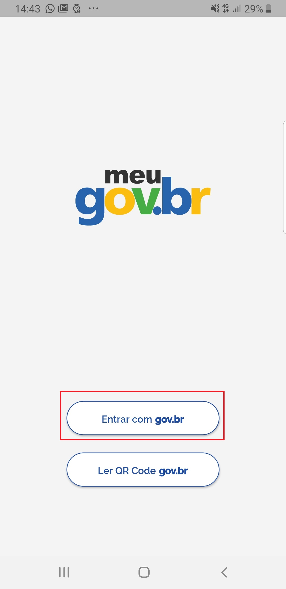

- Clique no botão **Crie sua Conta**

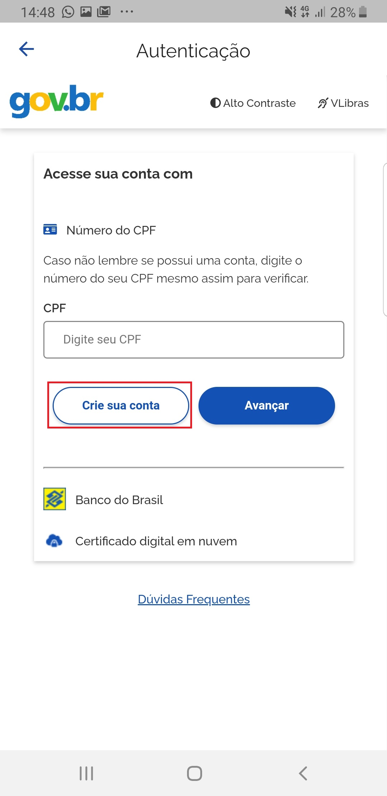

- Selecione opção deseja criar a conta do Login Único

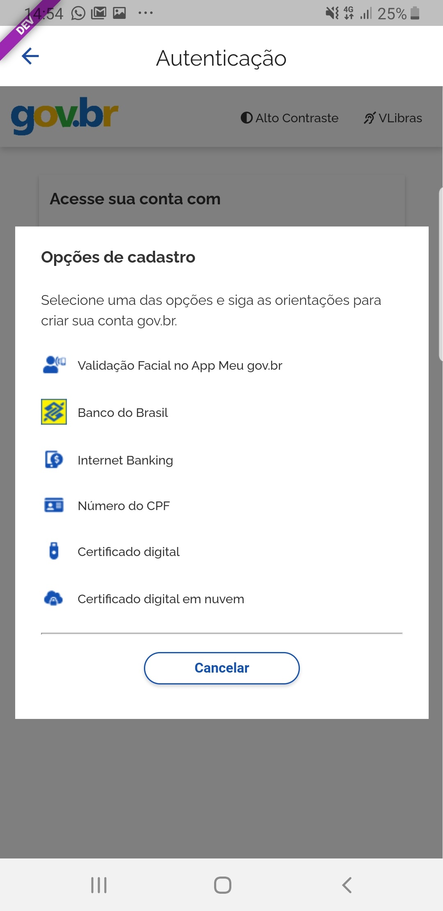

1. Validação Facial no App Meu gov.br
-------------------------------------   

- Selecione opção **Validação Facial no App Meu gov.br**

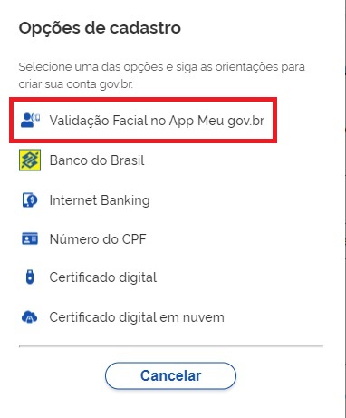
   
- Digite o CPF, marque as opções **Li e estou de acordo com os termos de uso** e **Não sou robô**. Clique no botão **Ir para Meu gov.br**

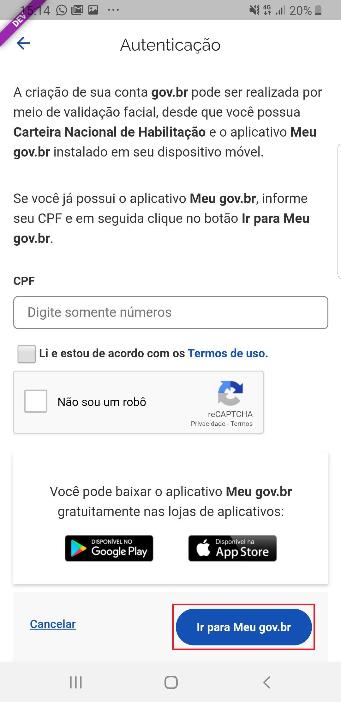

- Marque **Li e concorco com os termos e condições** e clique no botão **Aceitar**.

.. figure:: _images/termo_aceite_govbr_mobile.jpg
   :align: center
   :height: 770 px
   :width: 400 px
   :alt:

- Posicionar o rosto de frente para câmera frontal do celular seguindo as orientações de piscar os olhos e sorrir até sistema validar as informações.
   
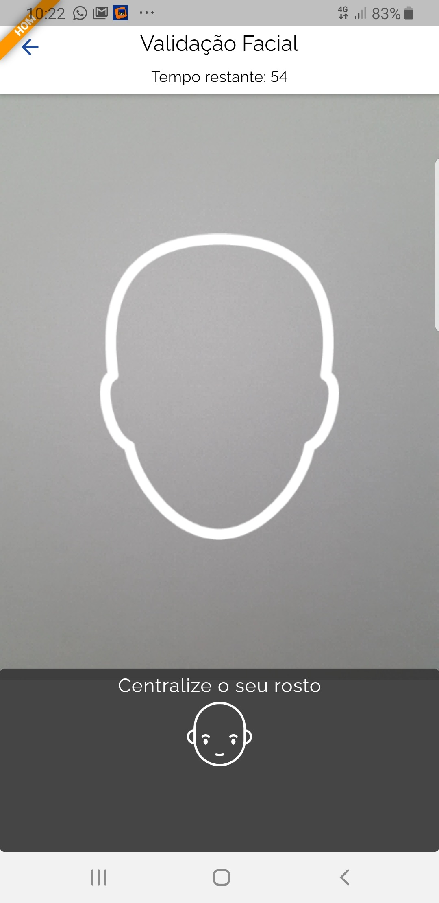

- Clique no **botão azul com ícone de câmera**.  

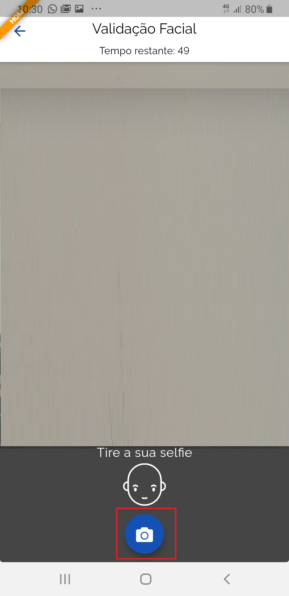

- Clique no botão **OK** e continue o processo da cadastro da conta

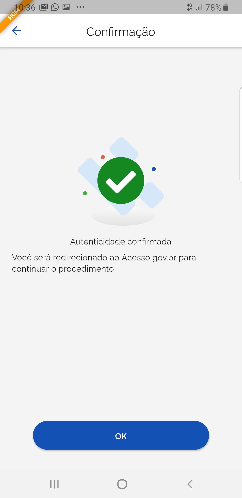

- Digite o Nome, Data de emissão da carteira de motorista(localizada na parte traseira da carteira) e clique no botão **Avançar**

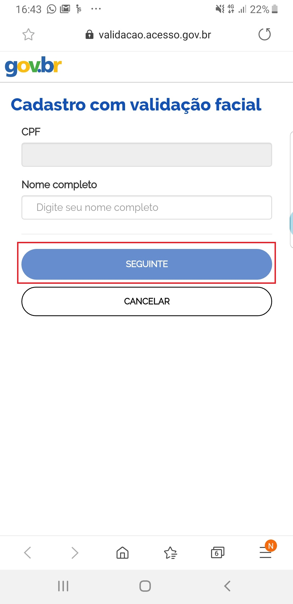

- Selecione a opção deseja ativar conta (email ou sms), preenche o conteúdo da opção (conta de email ou telefone celular) e clique no botão **Avançar**.   
   
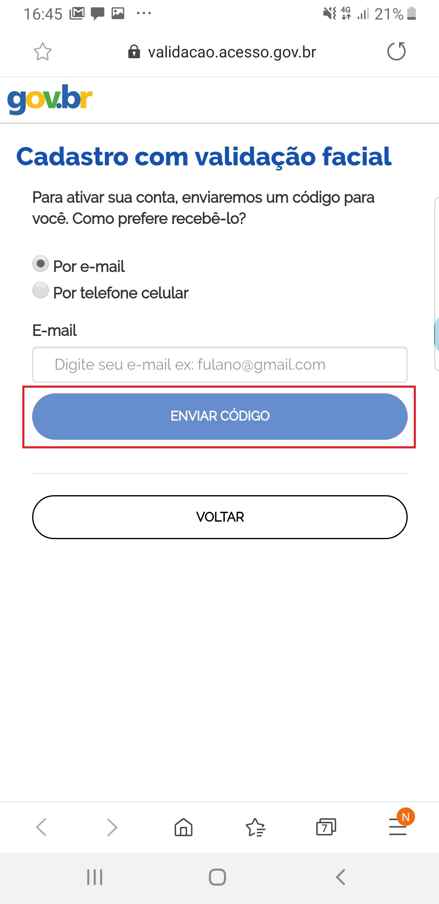

- Digite o código de acesso e clique no botão **Avançar**   
   
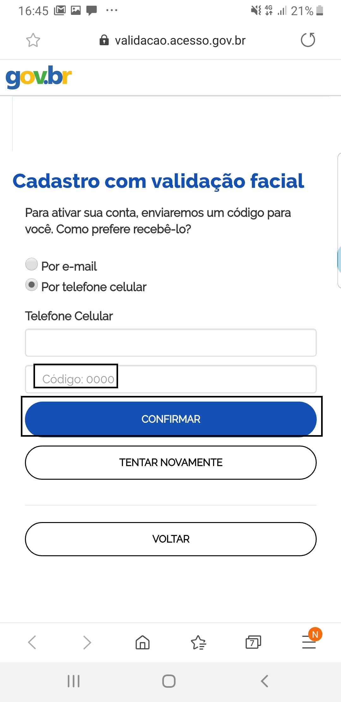

- Preencha com senha escolhida e clique no botão **Concluir** para finalizar o cadastro.   
   
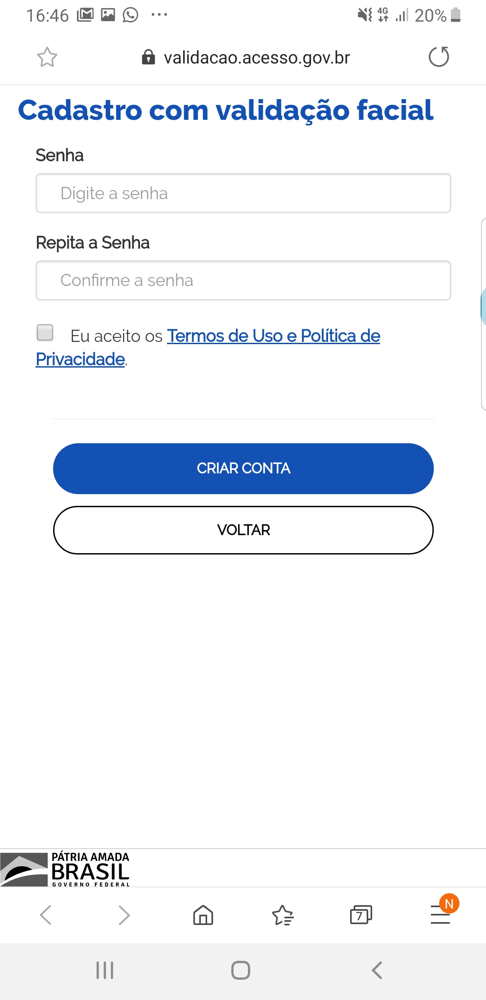

2. Banco do Brasil
------------------ 

- Tenha em mãos os números da agência, conta e senha de oito digitos do banco do brasil. Selecione opção **Banco do Brasil**.

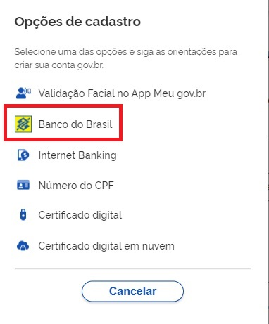

- Marque a opção **Li e estou de acordo com termos de uso** e clique no botão **Ir para Banco do Brasil**

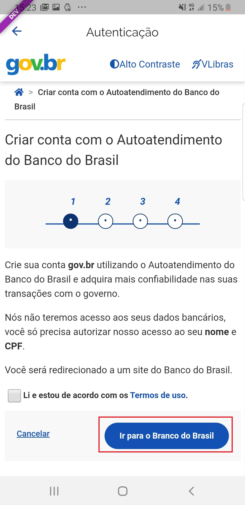
   
- Clique no botão **Continuar**.

.. figure:: _images/telacadastrobancobbdeclaracaobuscarinformacoes.jpg
   :align: center
   :alt:   
   
- Digite o número de agência, conta-corrente, senha de 8 digitos. Clique no botão **Entrar**.

.. figure:: _images/telacadastrobancobbdigitaragenciaconta.jpg
   :align: center
   :alt:   
    
- Digite o código de autorização recebido no aplicativo do Banco do Brasil. Clique no botão **Autorizar**.

.. figure:: _images/telacadastrobancobbdigitarcodigodeacesso.jpg
   :align: center
   :alt: 	

- Conferir CPF e Nome. Clicar no botão **Avançar**   

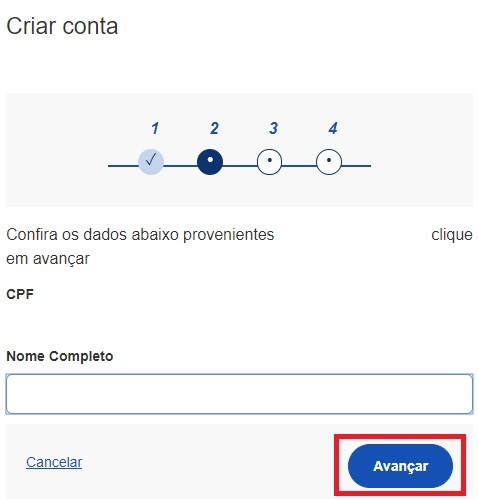

- Selecione a opção deseja ativar conta (email ou sms), preenche o conteúdo da opção (conta de email ou telefone celular) e clique no botão **Avançar**.   
   
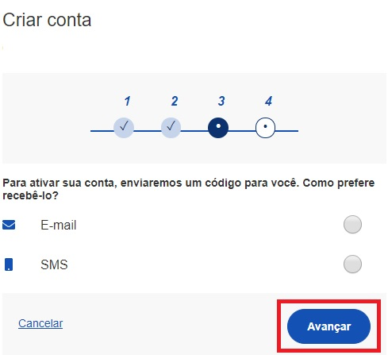
   
- Digite o código de acesso e clique no botão **Avançar**   
   
.. figure:: _images/tela_digitar_codigo_confirmacao_govbr_mobile_novogovbr.jpg
   :align: center
   :alt:   

- Preencha com senha escolhida e clique no botão **Concluir** para finalizar o cadastro.   
   
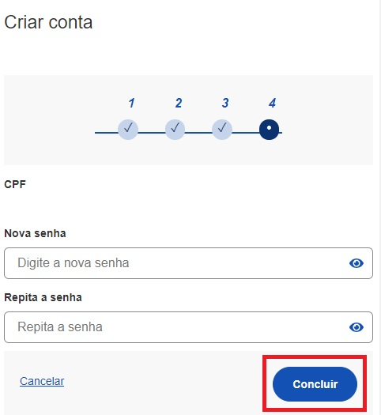

3. Internet Banking
-------------------

- Existem alguns bancos conveniados para permitir a criação da conta por meio da geração de uma senha temporária. A senha deverá ser trocada no primeiro acesso. Para isso, acesse o passo a passo de cada banco presente no link `acesse o passo a passo de cada banco`_.

- De posse da senha temporária, retorne tela inicial do login, digite o CPF e clique no botão **Avançar**. Existem senhas temporárias que precisam de 24h a 48h para ativação pelos bancos.   

.. figure:: _images/telainicialcombotaoproximagovbr_novagovbr.jpg
   :align: center
   :alt:

- Digite senha temporária, senha definitiva e marque opção **Não sou robô**. Após, clique no botão **Concluir** para criação da conta    

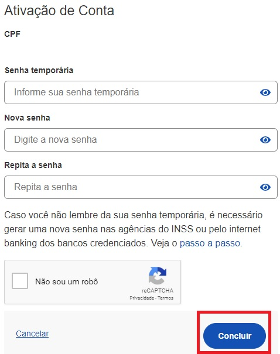

4. Número do CPF
--------------------------------------------------

- Selecione opção **Número do CPF**

.. figure:: _images/opcoes_criacao_conta_numero_cpf_novogovbr.jpg
   :align: center
   :alt: 

- Tenha em mãos um documento de identidade, número do CPF, nome completo, e-mail e número do celular. Preencha CPF, Nome, Marcar as opções **Li e estou de acordo com os Termos de uso.** e **Não sou robô**. Clique no botão **Avançar**

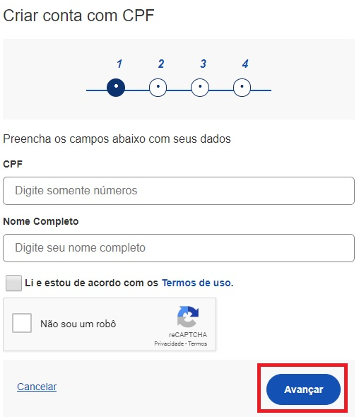
   
- Responda as perguntas relacionadas às suas informações pessoais. Clique no botão **Avançar**.

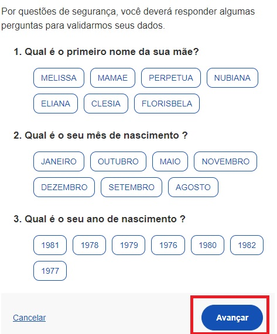

- Selecione a opção deseja ativar conta (email ou sms), preenche o conteúdo da opção (conta de email ou telefone celular) e clique no botão **Avançar**.   
   

   
- Digite o código de acesso e clique no botão **Avançar**   
   
.. figure:: _images/tela_digitar_codigo_confirmacao_govbr_mobile_novogovbr.jpg
   :align: center
   :alt:   

- Preencha com senha escolhida e clique no botão **Concluir** para finalizar o cadastro.   
   

5. Certificado Digital em Nuvem
-------------------------------

- Ative o certificado digital de pessoal física conforme orientações de cada provedor de certificado em nuvem (certficado deverá ser compatível com ICP-Brasil). Selecionar opção **Certificado em Nuvem**

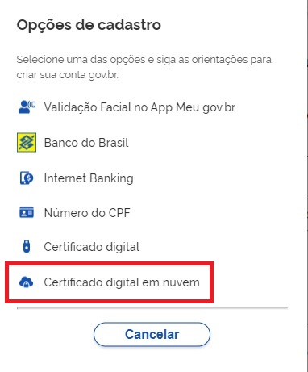

- Selecione a opção de certificado em nuvem que deseja cadastrar conta.

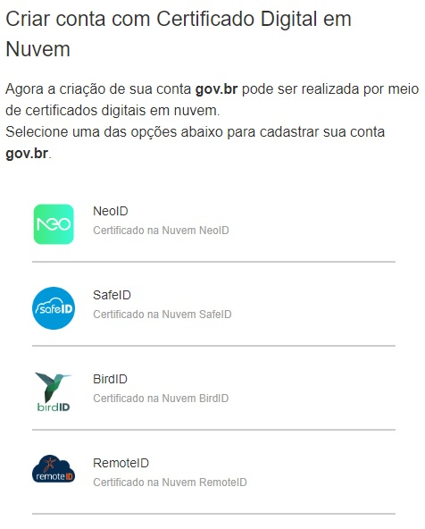

- Marque a opção **Li e estou de acordo com termos de uso** e clique no botão **Ir para** 

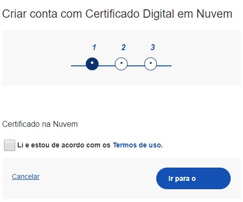

- Conferir CPF e Nome. Clicar no botão **Avançar**   

- Selecione a opção deseja ativar conta (email ou sms), preenche o conteúdo da opção (conta de email ou telefone celular) e clique no botão **Avançar**.   
   

   
- Digite o código de acesso e clique no botão **Avançar**   
   
.. figure:: _images/tela_digitar_codigo_confirmacao_govbr_mobile_novogovbr.jpg
   :align: center
   :alt:   

- Preencha com senha escolhida e clique no botão **Concluir** para finalizar o cadastro.   
   

   
.. |site externo| image:: _images/site-ext.gif
.. _`Orientações para baixar o aplicativo Meu GOV.BR` : oqueemeugovbrmobile.html
.. _`acesse o passo a passo de cada banco` : comocadastrarsenhatemporariadosbancosconveniados.html
            