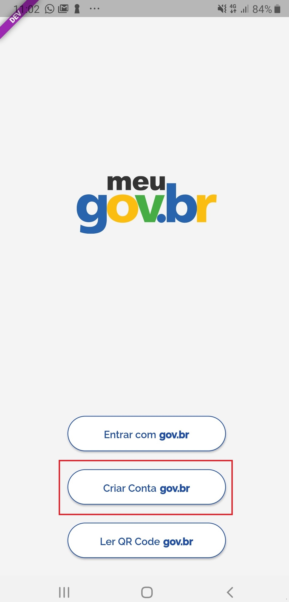
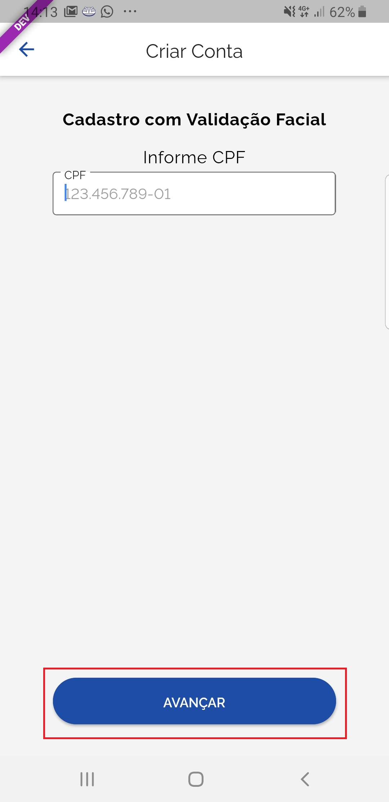
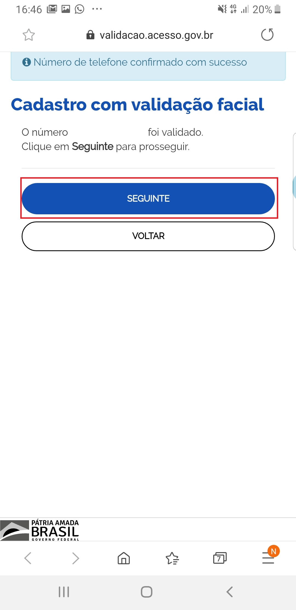

Como Cadastrar Conta de Acesso pelo Aplicativo Meu gov.br
=========================================================

1. Baixe e instale o aplicativo Meu gov.br. `Orientações para baixar o aplicativo Meu GOV.BR`_.

2. Acesse o aplicativo Meu GOV.BR no celular:

.. figure:: _images/icone_inicio_aplicativo_meu_gov.jpg
   :align: center
   :alt: 

3. Clique no botão **Criar Conta gov.br**

4. Digite CPF e clique no botão **Avançar**

5. Marque **Li e concorco com os termos e condições** e clique no botão **Aceitar**.

.. figure:: _images/termo_aceite_govbr_mobile.jpg
   :align: center
   :height: 770 px
   :width: 400 px
   :alt:

6. Posicionar o rosto de frente para câmera frontal do celular seguindo as orientações de piscar os olhos e sorrir até sistema validar as informações. Após, aguarde o aplicativo tirar foto.
   
.. figure:: _images/inicio_validacao_facial_govbr_mobile.jpg
   :align: center
   :height: 770 px
   :width: 400 px
   :alt:

7. Clique no botão **Enviar Foto**  

.. figure:: _images/tela_indicacao_enviar_foto_validacao_govbrmobile.jpg
   :align: center
   :height: 770 px
   :width: 400 px
   :alt: 

8. Clique no botão **OK** e continue o processo da cadastro da conta

.. figure:: _images/tela_confirmacao_validacao_govbr_continuar_mobile.jpg
   :align: center
   :height: 770 px
   :width: 400 px
   :alt:   

9. Digite o Nome e clique no botão **Seguinte**

.. figure:: _images/preenchimento_nome_cadastramento_conta_govbr_mobile.jpg
   :height: 770 px
   :width: 400 px
   :align: center
   :alt:   

10. Selecione a opção deseja ativar conta (email ou sms), preenche o conteúdo da opção (conta de email ou telefone celular) e clique no botão **Enviar Código**.   
   
.. figure:: _images/tela_envio_codigo_ativacao_conta_mobile.jpg
   :height: 770 px
   :width: 400 px
   :align: center
   :alt:

11. Digite o código de acesso e clique no botão **Confirmar**   
   
.. figure:: _images/tela_digitar_codigo_confirmacao_govbr_mobile.jpg
   :height: 770 px
   :width: 400 px
   :align: center
   :alt:   

12. Clique no botão **Seguinte** para cadastrar senha de acesso

13. Preencha com senha escolhida, marque opção **Eu aceito os termo de uso e política de privacidade** e clique no botão **Criar Conta** para finalizar o cadastro.   
   
.. figure:: _images/tela_criacao_senha_govbrmobile_por_mobile.jpg
   :height: 770 px
   :width: 400 px
   :align: center
   :alt:   

.. |site externo| image:: _images/site-ext.gif
.. _`Orientações para baixar o aplicativo Meu GOV.BR` : oqueemeugovbrmobile.html
            