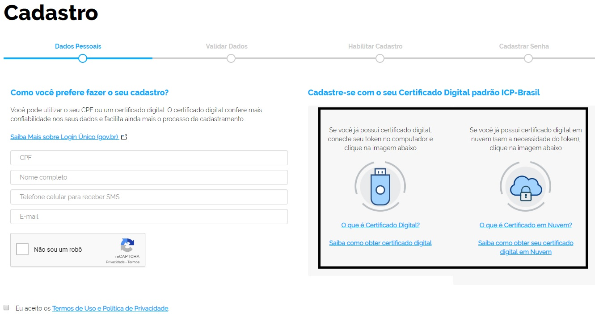

É possível criar conta de acesso com certificado digital?
=========================================================

Sim. Acesse `Fazer Cadastro`_ |site externo| e clique nas opçoes “Cadastro com Certificado Digital” ou "Cadastro com Certificado Digital com NEOID". 

O Certificado digital aceito pelo Brasil Cidadão é dos tipos A1 e A3. 

É necessário a instalação do `drive do certificado digital`_ |site externo| do dispositivo no computador. 

**Possíveis Palavras/Termos (Utilizado para busca no chatbot)**

- criação de conta com Certificado digital
- primeiro acesso com certificado digital
- quero me cadastrar com certificado digital
- posso fazer o cadastro com certificado digital
- posso usar meu certificado/token para o meu cadastro
- tenho um token/certificado digital, posso utilizá-lo
- quero utilizar meu token/certificado para meu primeiro cadastro
- Não estou conseguindo acessar com o certificado digital
- Qual certificado digital para acessar
- não consigo entrar com o certificado digital
- Estou tentando entrar com certificado digital, porém não tenho êxito  

.. _`Fazer Cadastro` : https://portal.brasilcidadao.gov.br/servicos-cidadao/acesso/#/primeiro-acesso
.. _`drive do certificado digital` : https://certificados.serpro.gov.br/arserpro/pages/information/drivers_token_download.jsf?
.. |site externo| image:: _images/site-ext.gif
            