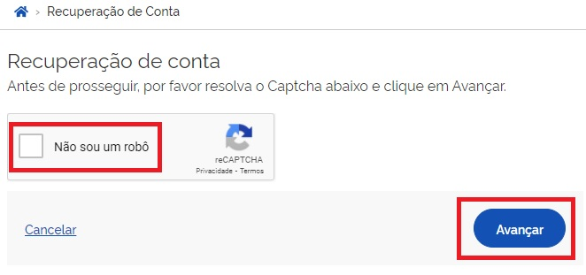
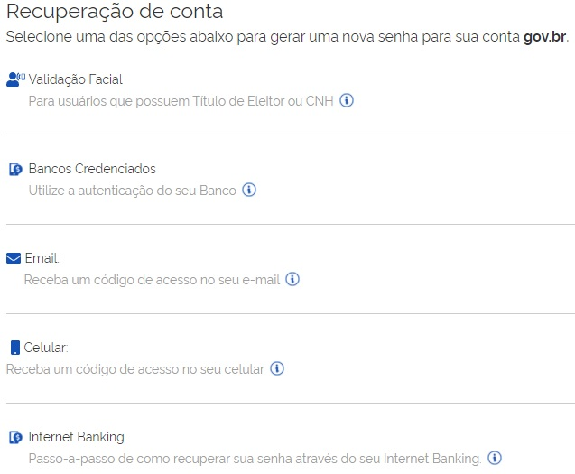
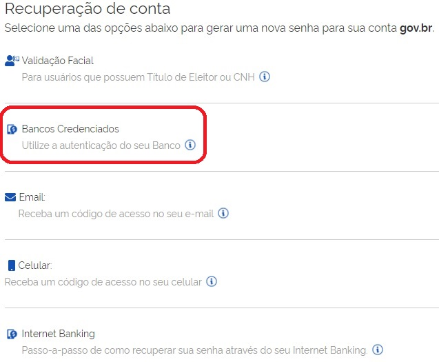
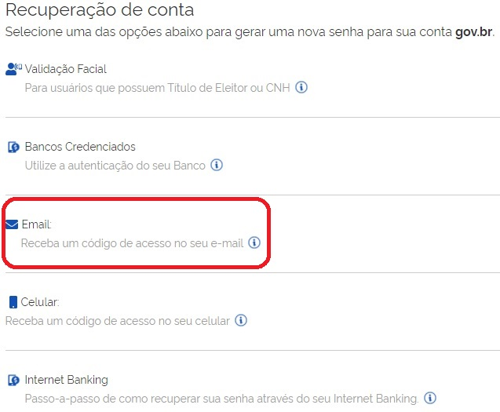
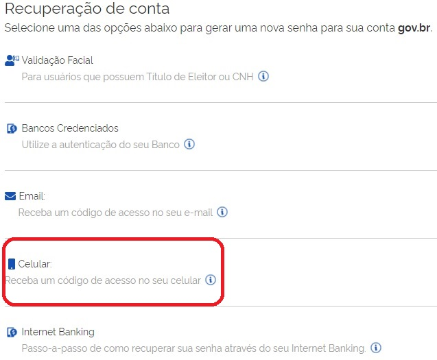
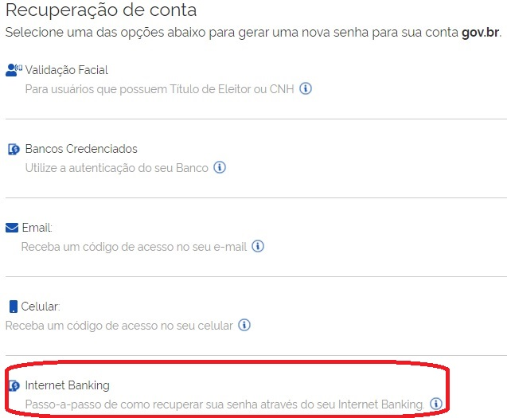

Como recuperar a conta de acesso?
=================================

- Para recuperar a conta de acesso, digite o CPF na tela inicial em https://acesso.gov.br e clique no botão **Continuar**.

.. image:: _images/telainicialcombotaoavancargovbr_govbr2versao.jpg
   :align: center
   :alt: 

- Clique no link **Esqueci minha senha**.   

.. image:: _images/telainicialcomlinkesqueciminhasenha_novagovbr.jpg
   :align: center
   :alt:

- Selecione a opção **Não sou robô** e clique no botão **Avançar**   

   
   
Existem diversas formas para recuperar a conta.

1. Recuperar a conta por meio do Aplicativo gov.br
--------------------------------------------------

- Marque a opção **Não sou um robô** e clique no botão **GERAR QR-CODE**

.. image:: _images/clicar_botao_com_qr_code_criacao_conta_novogovbr.jpg
   :align: center
   :alt:   

- O QR-CODE para criação da conta será apresentado em tela.    
   
.. image:: _images/apresentacao_qr_code_antes_aplicativo_govbr_criacao_conta_govbr2versao.jpg
   :align: center
   :alt:   

- Abra o aplicativo gov.br e clique no botão **Ler QR Code**

.. image:: _images/tela_inicial_meugov_botao_qr_code_govbr2versao.jpg
   :align: center
   :height: 770 px
   :width: 400 px
   :alt:   

- Aponte o celular para tela do computador com intuito de ler o QR-CODE   

.. image:: _images/tela_leitura_qr_code_aplicativo_govbr_govbr2versao.jpg
   :align: center
   :height: 770 px
   :width: 400 px
   :alt:   
   
- Clique no botão **Fazer Reconhecimento Facial**.

.. image:: _images/tela_instrucoes_reconhecimento_facial_aplicativo_govbr_govbr2versao.jpg
   :align: center
   :height: 770 px
   :width: 400 px
   :alt:
   
- Posicionar o rosto de frente para câmera celular, clique no **botão azul com figura de câmera** e siga as orientações de piscar os olhos e sorrir até sistema validar as informações.
   
.. image:: _images/tela_inicio_validacao_facial_govbr_mobile_govbr2versao.jpg
   :align: center
   :height: 770 px
   :width: 400 px
   :alt:   
   
- Clique no botão **OK** e continue o processo no computador

.. image:: _images/tela_confirmacao_validacao_govbr_continuar_computador_govbr2versao.jpg
   :align: center
   :height: 770 px
   :width: 400 px
   :alt:

- Preencha os campos com uma nova senha e clique no botão **Concluir** para recuperar o cadastro.   
   
.. image:: _images/tela_criacao_senha_govbrmobile_por_computador_novogovbr.jpg
   :align: center
   :alt:   

2. Recuperar conta por meio dos Bancos Credenciados
--------------------------------------------------- 

- Selecione a opção **Bancos Credenciados**. Tenha em mãos as informações do banco credenciado desejado. 

- Clique na imagem do banco credenciado desejado.

.. image:: _images/tela_clicar_imagem_banco_credenciado_recuperar_senha_novogovbr.jpg 
   :align: center
   :alt:

- Siga os procedimentos do banco credenciado.
   
- Defina a senha e clique no botão **Concluir** para finalizar a recuperação da sua conta.

.. image:: _images/telacadastramentosenhagovbr_novogovbr.jpg
   :align: center
   :alt:   
   
3. Recuperar conta por E-mail
-----------------------------

- Selecione a opção **E-mail**. 

- Marque a opção **Não sou um robô** e clique no botão **Enviar código**.

.. image:: _images/enviar_codigo_email_recuperar_senha_novogov.jpg
   :align: center
   :alt: 
   
- Abra o e-mail e busque o código de acesso encaminhado (confira na caixa de spam caso não esteja na caixa de entrada)

.. image:: _images/emailcomcodigoacessoparasenha_novogovbr.jpg
   :align: center
   :alt: 

- Digite o código de acesso e clique no botão **Avançar**

.. image:: _images/digitar_codigo_acesso_recuperacao_conta_novogovbr.jpg
   :align: center
   :alt: 
   
- Defina a senha e finalize a recuperação da sua conta.

.. image:: _images/telacadastramentosenhagovbr_novogovbr.jpg
   :align: center
   :alt:   

- Caso o email da conta de acesso não esteja correto, acesse as `orientações para solicitar alteração`_

4. Recuperar conta por Mensagem de Texto (SMS)
----------------------------------------------

- Selecione a opção **Celular**. 

- Marque a opção **Não sou um robô** e clique no botão **Enviar código**.

.. image:: _images/enviar_codigo_sms_recuperar_senha_novogov.jpg
   :align: center
   :alt: 
   
- Conferir a mensagem recebida no celular informado e digitar o código no campo **Código de 6 caracteres** e clique no botão **Avançar**

.. image:: _images/digitar_codigo_acesso_recuperacao_conta_novogovbr.jpg
   :align: center
   :alt: 
   
- Defina a senha e finalize recuperação da sua conta.

.. image:: _images/telacadastramentosenhagovbr_novogovbr.jpg
   :align: center
   :alt:   
   
5. Recuperar conta por meio do Internet Banking dos bancos conveniados
----------------------------------------------------------------------

- Selecione opção **Internet Banking**.

-  Existem alguns bancos conveniados para permitir a recuperação da conta por meio da geração de uma senha temporária. A senha deverá ser trocada no acesso. Para isso, `acesse o passo a passo de cada banco`_.
   
- De posse da senha temporária, retorne à tela inicial, digite o CPF e clique no botão **Avançar**. Existem senhas temporárias que precisam de 24h a 48h para ativação pelos bancos.   

.. image:: _images/telainicialcombotaoproximagovbr_novagovbr.jpg
   :align: center
   :alt:

- Digite a senha temporária, a senha definitiva e marque a opção **Não sou um robô**. Após isso, clique no botão **Concluir** para recuperar a conta    

.. image:: _images/tela_senha_temporaria_novogovbr.jpg
   :align: center
   :alt:   
   
.. |site externo| image:: _images/site-ext.gif
.. _`orientações para solicitar alteração`: naotenhoacessoaoemailcadastradonologin.html 
.. _`acesse o passo a passo de cada banco` : comocadastrarsenhatemporariadosbancosconveniados.html
 
