Como recuperar conta de acesso?
===============================

- Para recuperar conta de acesso, digite o CPF na tela inicial e clique no botão **Proxima**.

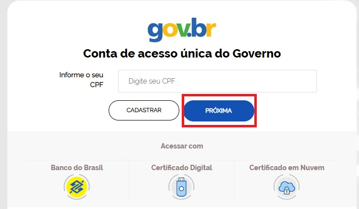

- Clique no link **esqueci minha senha**.   

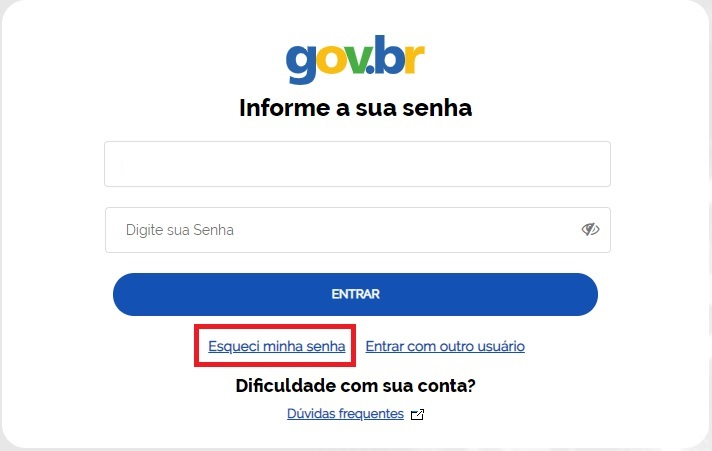

- Digite o CPF e marque a opção **Não sou um robô**.

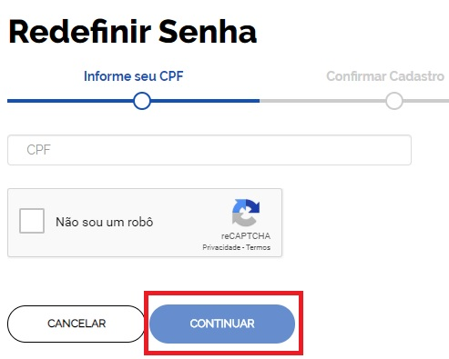

Existem diversas formas para recuperar conta do Login Único.

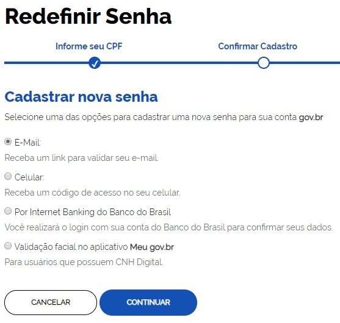

1. Recuperar conta por meio do Aplicativo Meu gov.br
--------------------------------------------

- Selecione a opção **Validação facial no aplicativo Meu gov.br** e clique no botão **Continuar**.

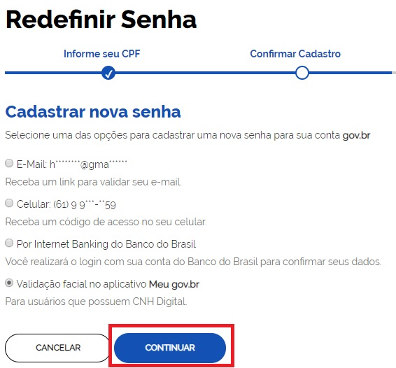

- Digite o CPF e clique no botão **GERAR QR-CODE**

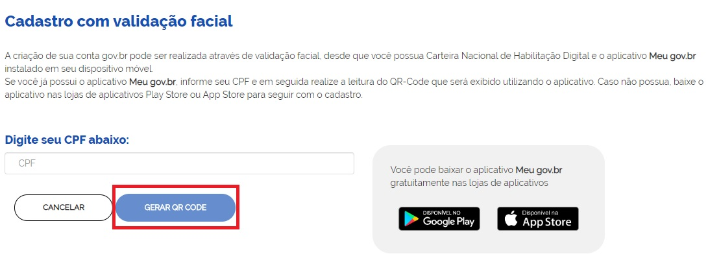

- O QR-CODE para recuperação da conta será apresentado em tela.    
   
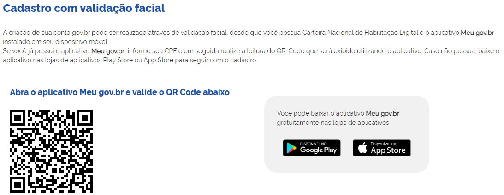

- Abra o aplicativo Meu gov.br e clique no botão **Ler QR Code gov.br**

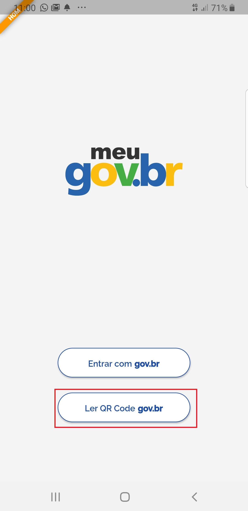

- Aponte o celular para tela do computador com intuito de ler o QR-CODE   

.. figure:: _images/tela_leitura_qr_code_aplicativo_govbr.jpg
   :align: center
   :height: 770 px
   :width: 400 px
   :alt:   
   
- Marque **Li e concorco com os termos e condições** e clique no botão **Aceitar**.

.. figure:: _images/termo_aceite_govbr_mobile.jpg
   :align: center
   :height: 770 px
   :width: 400 px
   :alt:

- Posicionar o rosto de frente para câmera frontal do celular seguindo as orientações de piscar os olhos e sorrir até sistema validar as informações. Após, aguarde o aplicativo tirar foto.
   
.. figure:: _images/inicio_validacao_facial_govbr_mobile.jpg
   :align: center
   :height: 770 px
   :width: 400 px
   :alt:   

- Clique no botão **Enviar Foto**  

.. figure:: _images/tela_indicacao_enviar_foto_validacao_govbrmobile.jpg
   :align: center
   :height: 770 px
   :width: 400 px
   :alt: 

- Clique no botão **OK** e continue o processo no computador

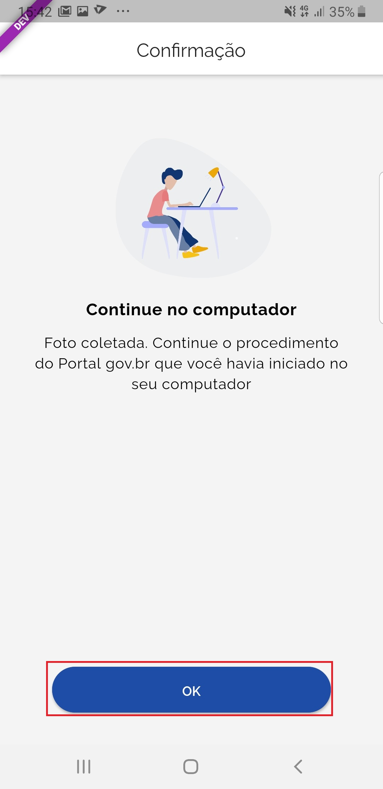

- Preencha com senha escolhida, marque opção **Eu aceito os termo de uso e política de privacidade** e clique no botão **Criar Conta** para recuperar o cadastro.   
   
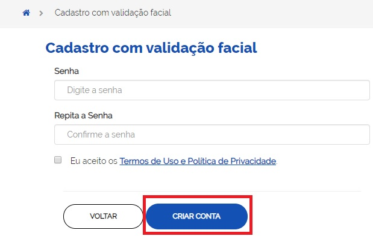

2. Recuperar conta por meio do Internet Banking do Banco do Brasil
----------------------------------------------------------- 

- Selecione a opção **Por Internet Banking do Banco do Brasil** e clique no botão **Continuar**. Tenha em mãos os números da agência, conta e senha de oito digitos do banco do brasil. 

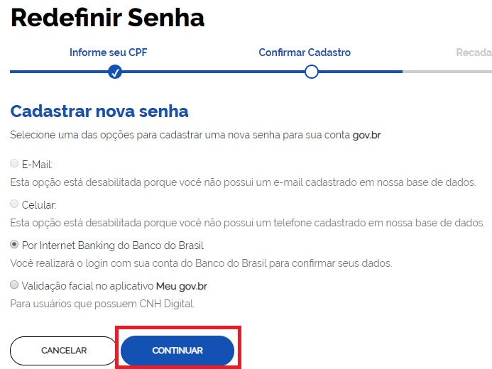

- Clique no botão **Continuar**.

.. figure:: _images/telacadastrobancobbdeclaracaobuscarinformacoes.jpg
   :align: center
   :alt:   
   
- Digite o número de agência, conta-corrente, senha de 8 digitos. Clique no botão **Entrar**.

.. figure:: _images/telacadastrobancobbdigitaragenciaconta.jpg
   :align: center
   :alt:   
    
- Digite o código de autorização recebido no aplicativo do Banco do Brasil. Clique no botão **Autorizar**.

.. figure:: _images/telacadastrobancobbdigitarcodigodeacesso.jpg
   :align: center
   :alt: 	

- Defina a senha e finalize recuperação da sua conta.

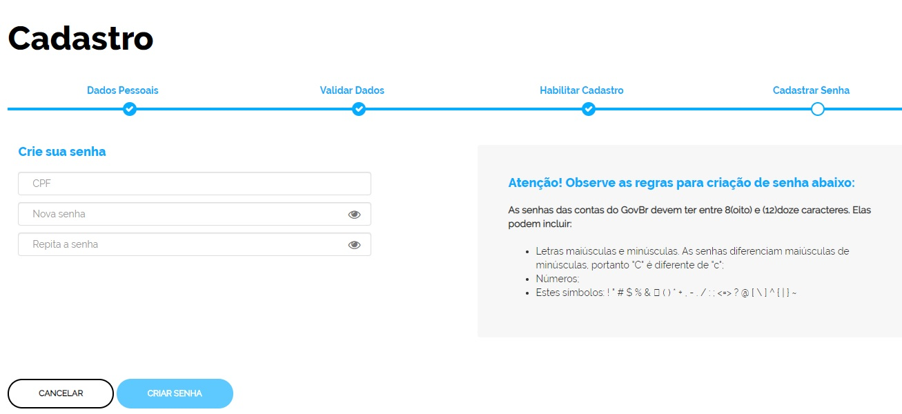
   
.. 3. Recuperar conta por meio do Internet Banking dos bancos conveniados
---------------------------------------------------------------

.. - Selecione opção **Internet Banking dos bancos conveniados** e clique no botão **Continuar**.

.. .. figure:: _images/criacaocontaporbancosconveniadosinicio.jpg
   :align: center
   :alt:

.. -  Existem alguns bancos conveniados para permitir a recuperação da conta por meio da geração de uma senha temporária. A senha deverá ser trocada no acesso. Para isso, acesse o passo a passo de cada banco presente no link **Veja o passo a passo**
   
.. ..figure:: _images/criacaocontaporbancosconveniadosinicio.jpg
   :align: center
   :alt:   
   
.. - De posse da senha temporária, retorne tela inicial do login, digite o CPF e clique no botão **Proxima**. Existem senhas temporárias que precisam de 24h a 48h para ativação pelos bancos.   

.. .. figure:: _images/criacaocontaporbancoconveniadotelainiciallogincpf.jpg
   :align: center
   :alt:

.. - Digite senha temporária, senha definitiva e marque opção **Não sou robô**. Após, clique no botão **Criar Senha** para recuperar a conta    

.. .. figure:: _images/tela_senha_temporaria.jpg
   :align: center
   :alt:

3. Recuperar conta por E-mail
-------------------------

- Selecione a opção **e-mail** e clique no botão **Continuar**. 

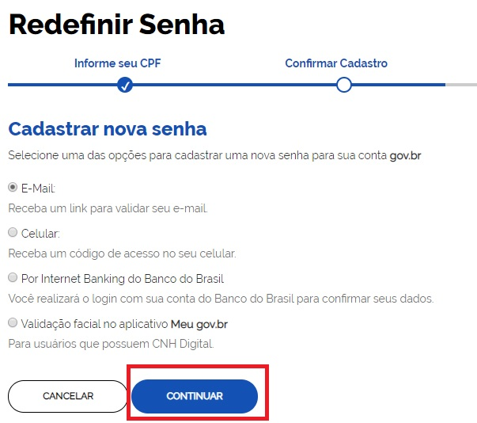
   
- Abra o e-mail e clique no link enviado (confira na caixa de spam caso não esteja na caixa de entrada)

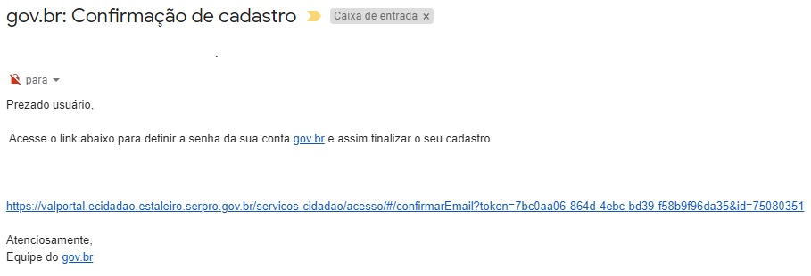

- Defina a senha e finalize recuperação da sua conta.

- Caso o email da conta de acesso não esteja correto, acesse as `orientações para solicitar alteração`_

4. Recuperar conta por Mensagem de Texto (SMS)
-----------------------------------------

- Selecione a opção **Celular** e clique no botão **Continuar**. 

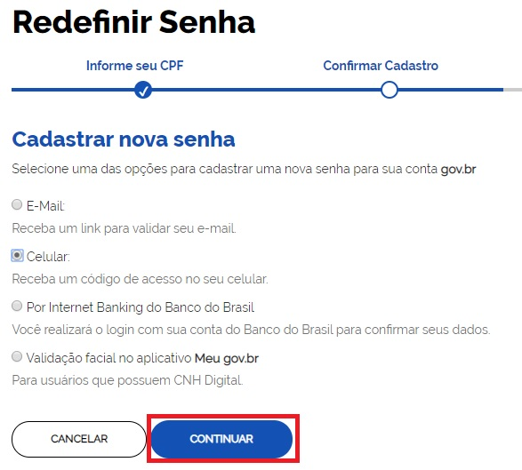
   
- Conferir a mensagem recebida no celular informado e digitar o código no campo **Informe o código de validação** e clique no botão **Validar Cadastro**

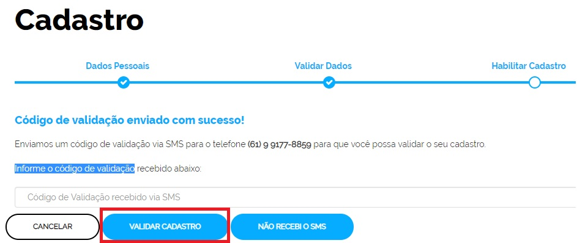
   
- Defina a senha e finalize recuperação da sua conta.

   
.. |site externo| image:: _images/site-ext.gif
.. _`orientações para solicitar alteração`: naotenhoacessoaoemailcadastradonologin.html 
 