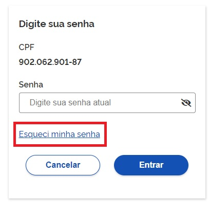
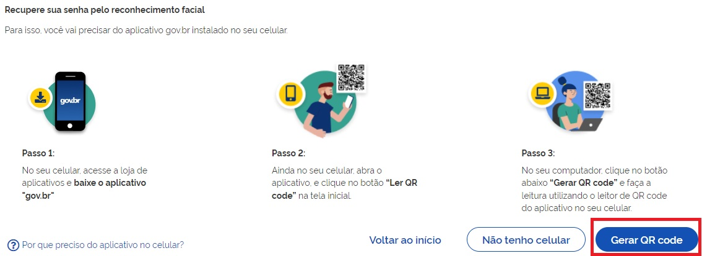
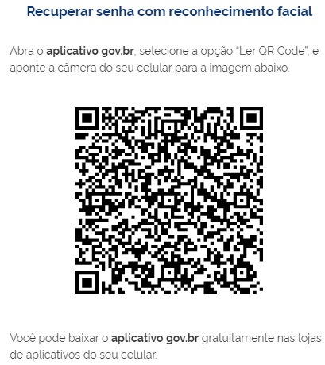
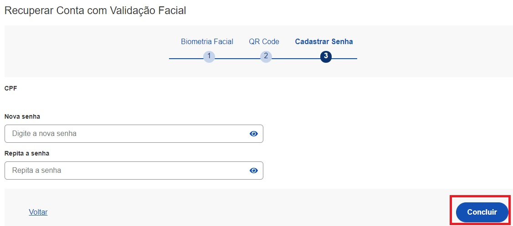
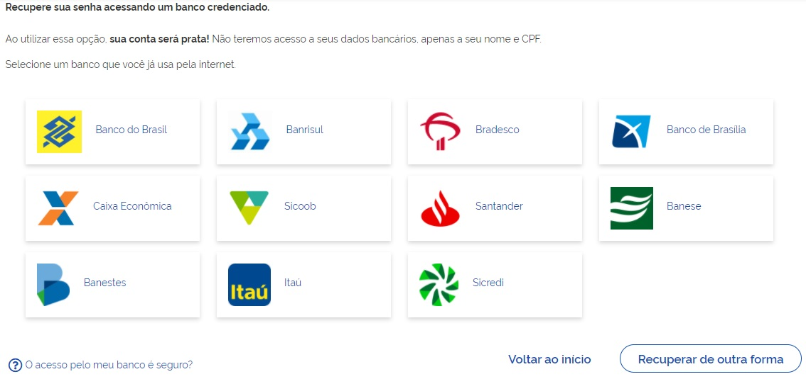
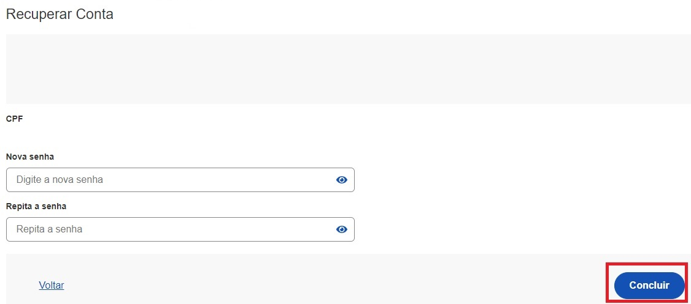
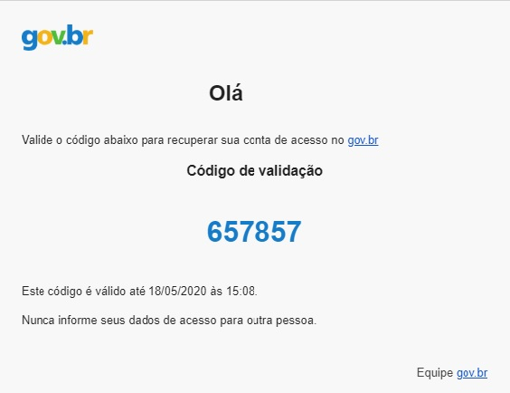
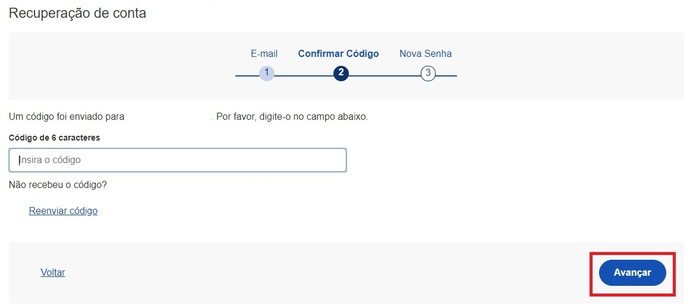
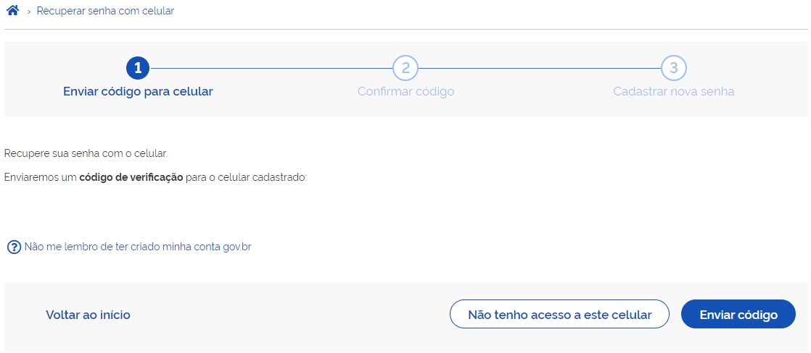

Como recuperar a conta de acesso?
=================================

- Para recuperar a conta de acesso, digite o CPF na tela inicial em https://acesso.gov.br e clique no botão **Continuar**.

.. image:: _images/telainicialcombotaoavancargovbr_govbr2versao.jpg
   :align: center
   :alt: 

- Clique no link **Esqueci minha senha**.   

- O Login Único avaliará a forma mais segura para recuperar a conta ao cidadão.   

- Caso a opção não seja a melhor para momento, estará disponível outra opção para cidadão realizar a recuperação na mesma tela.
   
1. Recuperar a conta por meio do Aplicativo gov.br
--------------------------------------------------

- Clique no botão **GERAR QR-CODE**. Caso não possa recuperar pelo Aplicativo, basta clicar no botão **Não tenho celular**

- O QR-CODE para criação da conta será apresentado em tela.    
   

- Abra o aplicativo gov.br e clique no botão **Ler QR Code**

.. image:: _images/tela_inicial_meugov_botao_qr_code_govbr2versao.jpg
   :align: center
   :height: 770 px
   :width: 400 px
   :alt:   

- Aponte o celular para tela do computador com intuito de ler o QR-CODE   

.. image:: _images/tela_leitura_qr_code_aplicativo_govbr_govbr2versao.jpg
   :align: center
   :height: 770 px
   :width: 400 px
   :alt:   
   
- Clique no botão **Fazer Reconhecimento Facial**.

.. image:: _images/tela_instrucoes_reconhecimento_facial_aplicativo_govbr_govbr2versao.jpg
   :align: center
   :height: 770 px
   :width: 400 px
   :alt:
   
- Posicionar o rosto de frente para câmera celular  e siga as orientações até sistema validar as informações.
   
.. image:: _images/tela_inicio_validacao_facial_govbr_mobile_govbr2versao.jpg
   :align: center
   :height: 770 px
   :width: 400 px
   :alt:   
   
- Clique no botão **OK** e continue o processo no computador

.. image:: _images/tela_confirmacao_validacao_govbr_continuar_computador_govbr2versao.jpg
   :align: center
   :height: 770 px
   :width: 400 px
   :alt:

- Preencha os campos com uma nova senha e clique no botão **Concluir** para recuperar o cadastro.   
   

2. Recuperar conta por meio dos Bancos Credenciados
--------------------------------------------------- 

- Clique na imagem do banco credenciado desejado. Caso não possa recuperar pelo banco, basta clicar no botão **Recuperar de outra forma**

- Siga os procedimentos do banco credenciado.
   
- Defina a senha e clique no botão **Concluir** para finalizar a recuperação da sua conta.

   
3. Recuperar conta por E-mail
-----------------------------

- Conferir se o email está correto do cadastro e clique no botão **Enviar código**. Caso não possa recuperar pelo email, basta clicar no botão **Não tenho acesso a este email**

   
- Abra o e-mail e busque o código de acesso encaminhado (confira na caixa de spam caso não esteja na caixa de entrada)

- Digite o código de acesso e clique no botão **Avançar**

   
- Defina a senha e finalize a recuperação da sua conta.

- Caso o email da conta de acesso não esteja correto, acesse as `orientações para solicitar alteração`_

4. Recuperar conta por Mensagem de Texto (SMS)
----------------------------------------------

- Conferir se o número de celular está correto do cadastro e clique no botão **Enviar código**. Caso não possa recuperar pelo número de celular, basta clicar no botão **Não tenho acesso a este celular**

   
- Conferir a mensagem recebida no celular informado e digitar o código no campo **Código de 6 caracteres** e clique no botão **Avançar**

   
- Defina a senha e finalize recuperação da sua conta.

   
     
.. |site externo| image:: _images/site-ext.gif
.. _`orientações para solicitar alteração`: naotenhoacessoaoemailcadastradonologin.html 
 
