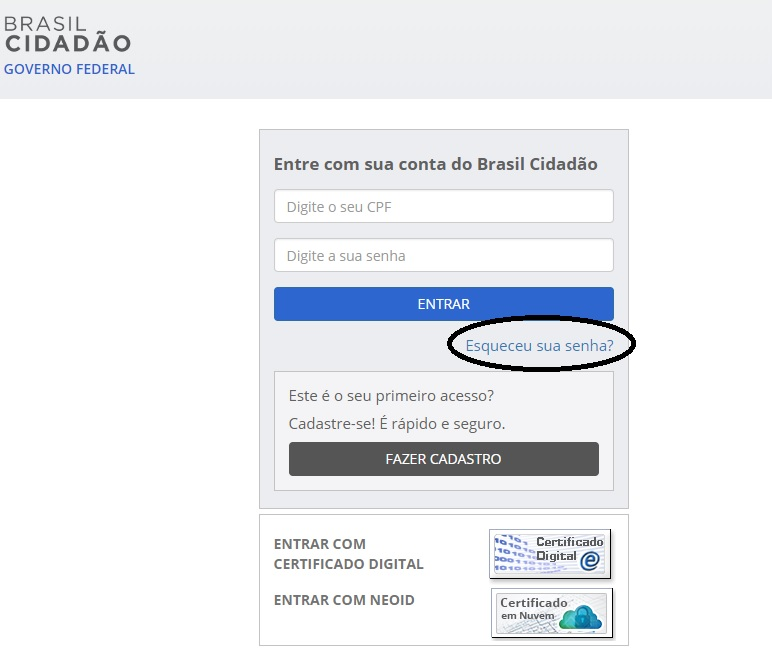
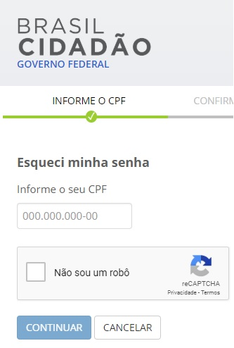

O usuário já possui cadastro no Sistema
=======================================

Algum momento o cidadão realizou o cadastro no Login Único. Não existe opção de excluir conta no Login Único 

Caso não lembre da senha, favor realizar os passos:

- Recuperar senha acessando `Esqueceu sua senha?`_ |site externo|:

   
- Informe seu CPF e clique em continuar.

Ao fazer isso, a senha do CPF irá para o e-mail cadastrado na conta do Login Único.

**Possíveis Palavras/Termos (Utilizado para busca no chatbot)**

- Mensagem: O usuário já possui cadastro no Sistema; 
 
.. _`Esqueceu sua senha?`: https://portal.brasilcidadao.gov.br/servicos-cidadao/acesso/#/recuperarSenha
.. |site externo| image:: _images/site-ext.gif
            