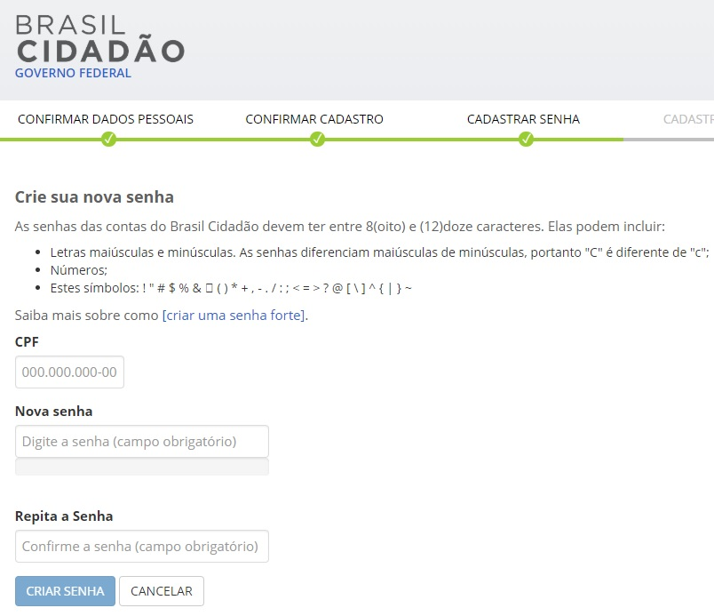

Não consigo cadastrar senha?
============================

Senhas das contas do Login Único devem ter entre 8(oito) e (12) doze caracteres. 

Podem incluir:

- Letras maiúsculas e minúsculas. As senhas diferenciam maiúsculas de minúsculas, portanto "C" é diferente de "c";
- Números;
- Símbolos (! " # $ % & ‘ ( ) * + , - . / : ; < = > ? @ [ \ ] ^ { | }) 

Evite senhas comuns como:

- Datas
- 12345678
- nomes

Para o cadastramento da senha, o Login Único solicita o preenchimento da senha no campo **Nova Senha** e repeti-lá o campo **Repita a senha** e depois clicar no botão **CRIAR SENHA**.

Verificar se a senha digitada está mesma em ambos os campos, porque o Login Único checa antes de realizar o cadastramento.

Caso persista o problema, encaminhe e-mail para cidadaniadigital@planejamento.gov.br e detalhe o problema.

**Possíveis Palavras/Termos (Utilizado para busca no chatbot)** 

- Não consigo cadastrar senha
- senha não está igual
- Aparece que a senha não está igual
- A senha não confirma mesmo estando igual
- Não aceita a senha
- Senha do Login Único/Brasil Cidadão/govbr não é aceita
- Problema com senha para entrar na conta do Brasil Cidadao/Login Único/govbr
- Não estou conseguindo fazer senha
- repetir senha e não aceitou
- Não consigo cadastrar senha

.. |site externo| image:: _images/site-ext.gif
            