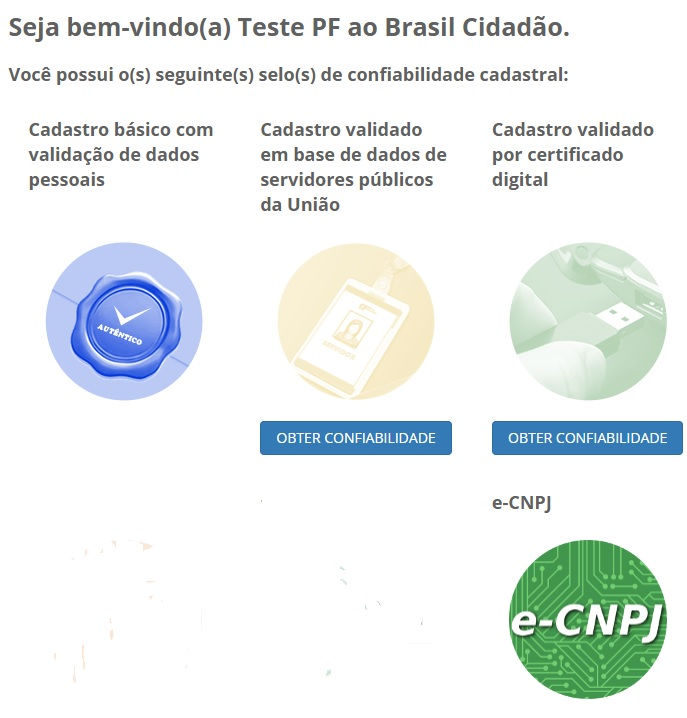

Obter mais confiabilidade na conta de acesso
============================================

Selo de confiabilidade cadastral serve para aumentar a confinaça da conta de acesso digital do cidadão, podendo também qualificar o cidadão em determinado papel/perfil em um serviço público digital por exemplo, servidor público, possuidor de certificado digital e outros.

Utilize os selos para tornar a sua conta de acesso mais confiável e autêntica, clicando no botão localizado abaixo de cada selo ou clique na opção "Obter Confiabilidade Cadastral" da tela inicial do Login Único e escolha o selo que deseja obter.

Informações gerais:

- Para obter um selo de Servidor Público você precisa ser um Servidor Público do Poder Executivo Federal. Servidores dos demais poderes e servidores de Estados e Municípios não estão recebendo este tipo de selo.
- Para obter o selo de Certificado Digital é necessário que você tenha um certificado digital dos tipos A1 ou A3, ambos compatíveis com ICP-BRASIL. Para saber como e onde obter o seu certificado digital, acesse o `ITI`_ |site externo|
- Para obter o selo e-CNPJ é necessário que a pessoa jurídica tenha certificado digital Pessoa Jurídica do tipo A3 compatível com ICP-BRASIL. 

**Possíveis Palavras/Termos (Utilizado para busca no chatbot)**

- selo
- qualificação
- perfil
- confiabilidade cadastral
- selos do cidadão
- obter selo
- obtenção de selo
- Confiabilidade cadastral
- biometria
- balcão
- Servidor Público
- Certificado Digital
- quero ter o selo/certificado balcão/biometrico/digital/servidor publico/dni
- como conseguir o selo/certificado balcão/biometrico/digital/servidor publico/dni
- preciso do selo/certificado balcão/biometrico/digital/servidor publico/dni
- preciso obter o selo/certificado balcão/biometrico/digital/servidor publico/dni
- do que preciso para ter o selo/certificado balcão/biometrico/digital/servidor publico/dni
- o que é necessário para obter o selo/certificado balcão/biometrico/digital/servidor publico/dni

.. _`ITI` : http://www.iti.gov.br/certificado-digital
.. |site externo| image:: _images/site-ext.gif
            