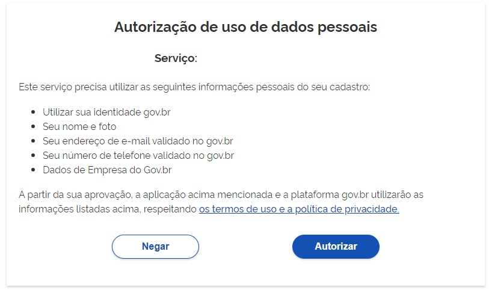

O que é autorização de uso de dados?
====================================

A autorização de uso de dados do cidadão é o ato de permitir que um determinado serviço público digital receba ou acesse seus dados pessoais de identificação ou complementares, como RG, CPF, endereço, nome completo, etc.

Lembrando que você poderá desautorizar o uso de seus dados pessoais a qualquer tempo.

Visualize as autorizações concedidas na opção de menu **Privacidade** e **Gerenciar Lista de Permissões** no Login Único.

.. figure:: _images/autorizacoesusodedados_novogov.jpg
   :align: center
   :alt: 

.. |site externo| image:: _images/site-ext.gif
            
