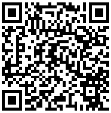

O que é QR-CODE?
================

Código de resposta rápida. Esse é o nome completo do QR Code (Quick Response Code).

Consiste em um gráfico 2D que pode ser lido pelas câmeras dos celulares.

 
O Login Único utiliza o QR-CODE para permitir a `criação da conta de acesso`_ e a `recuperação da conta de acesso`_.

.. |site externo| image:: _images/site-ext.gif
.. _`criação da conta de acesso`: criacaocontapelogovbrmobile.html
.. _`recuperação da conta de acesso`: formarrecuperarconta.html
            