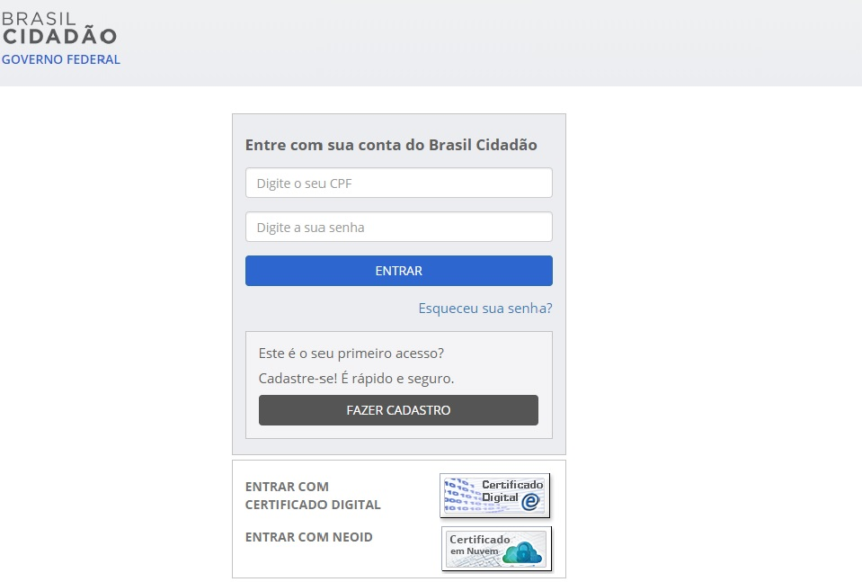

Por quais meios posso acessar?
==============================

O Login Único pode ser acessado por:

- Computador
- Laptop/notebook
- Smartphone

Acesso ao `Login Unico`_ |site externo|   

**Possíveis Palavras/Termos (Utilizado para busca no chatbot)**

- por quais meios eu posso acessar o login único/Brasil Cidadão
- quais os meios de acesso ao login único/Brasil Cidadão
- como acesso o login único/Brasil Cidadão
- por onde acesso o login único/Brasil Cidadão
- tem login único/Brasil Cidadão para celular/smartphone/mobile
- posso acessar pelo celular/smartphone/mobile
- posso usar o meu celular/smartphone/mobile
- tem login único/Brasil Cidadão para celular/smartphone/mobile
- quero usar o login único/Brasil Cidadão no celular/smartphone/mobile
- não tenho computador e quero usar o celular/smartphone/mobile 

.. _`Login Unico`: https://scp.brasilcidadao.gov.br/scp/login

.. |site externo| image:: _images/site-ext.gif
            