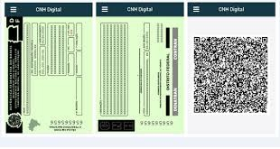

Por que preciso da Carteira Nacional de Habilitação Digital (CNH Digital)?
=========================================================================

O cadastro da conta de acesso por meio do aplicativo Meu gov.br precisa passar por um processo chamado Validação Facial.

Validação Facial consiste na checagem da pessoa por meio de movimentações aleatórias em frente da câmera frontal do celular e, após, a tiragem de uma foto a ser encaminhada para confirmação na base de dados da Carteira Nacional de Habilitação Digital (CNH Digital).

Mais detalhes sobre Carteira Nacional de Habilitação Digital, acesse as `orientações sobre carteira digital de trânsito`_.    

 
.. |site externo| image:: _images/site-ext.gif
.. _`orientações sobre carteira digital de trânsito`: https://servicos.serpro.gov.br/carteira-digital/            