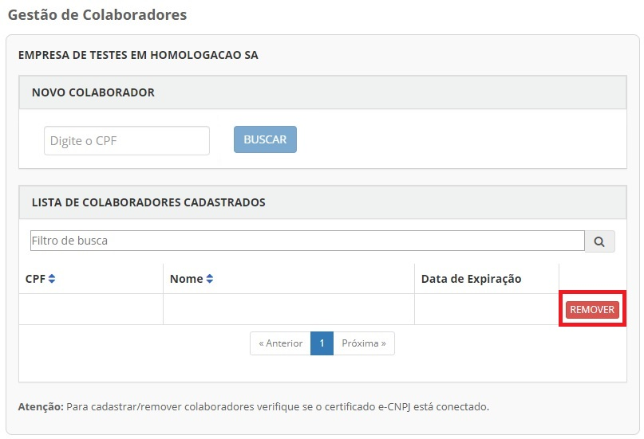

Retirar Colaborador do CNPJ
=================================

Para realizar a retirara de colaboradores, favor seguir os passos:

- Cidadão deve acessar no menu **CNPJ**.  

.. figure:: _images/tela_selecao_inicio_processo_colaborador.jpg
    :align: center
    :alt: 

- Cidadão clica no botão **Gerenciar Colaboradores**

.. figure:: _images/tela_selecao_sistema_gestao_colaborador.jpg
    :align: center
    :alt:
	
- Cidadão deve acessar no menu **Gestão de Colaboradores**

.. figure:: _images/tela_selecionar_modulo_gestao_colaboradores.jpg
    :align: center
    :alt:

- Cidadão aciona o Certificado Digital de Pessoa Jurídica ao computador (Tipo A1 - máquina - ou Tipo A3 - Token) do representante do CNPJ. Localiza o CPF do Colaborador deseja remover. Clica no botão **Remover**

 
.. |site externo| image:: _images/site-ext.gif
.. _`selo eCNPJ`: comocadastrarCNPJnologinunico.html
            