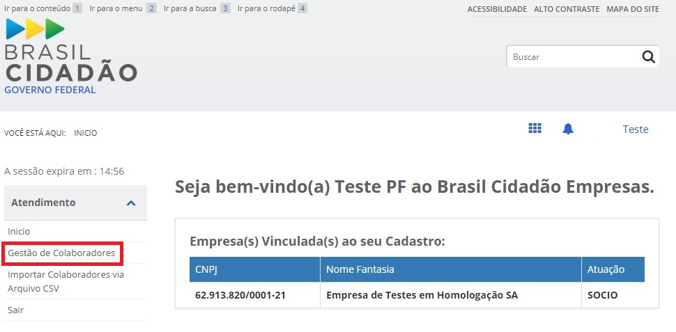
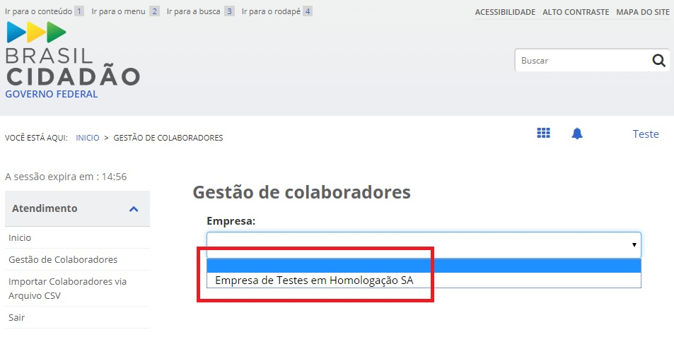
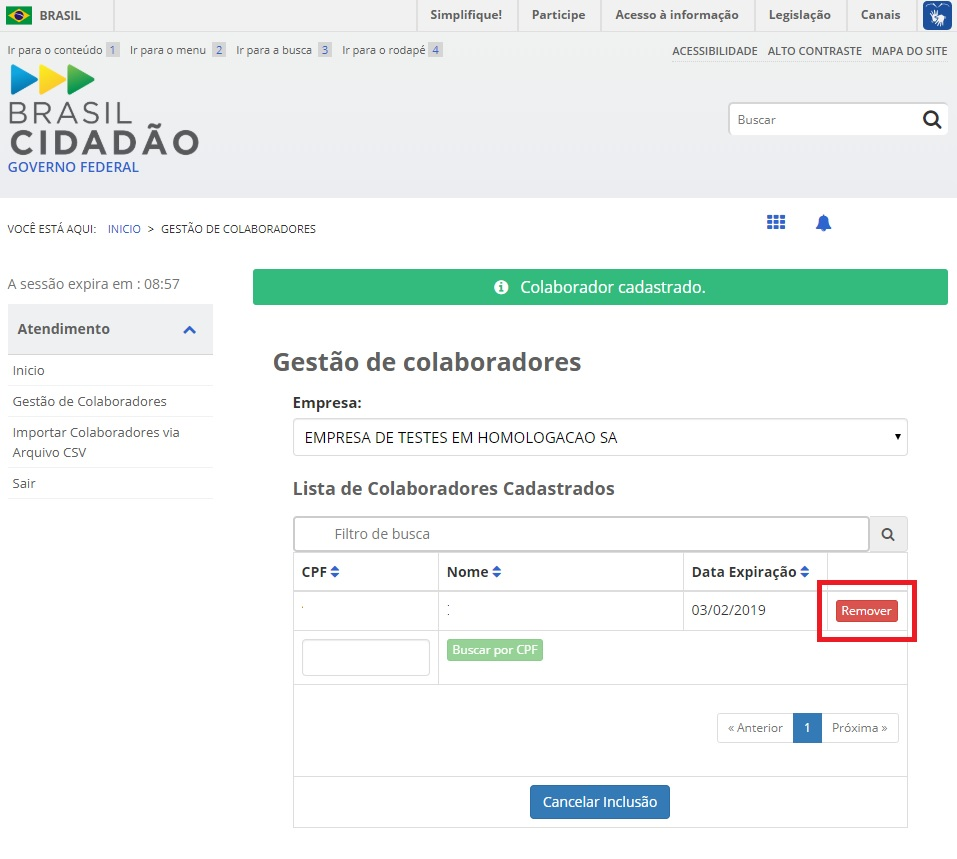

Retirar Colaborador do CNPJ
=================================

Para realizar a retirara de colaboradores, favor seguir os passos:

1. Acesse o `Módulo Empresas`_ |site externo| e selecione o item **Gestão de Colaboradores**. Lembrar que o responsável pela retirada de colaboradores será o usuário no Login Único que possui `selo eCNPJ`_ e o certificado digital de pessoa jurídica da empresa.    

2. Selecione a empresa que deseja retirar o colaborador

3. Com a seleção da empresa, será apresentado os colaboradores cadastrados na empresa. Clique no botão **Remover** para descredenciar.

**Prestar atenção**:
 
- *O certificado da pessoa juridíca tem estar no computador;* 

**Possíveis Palavras/Termos (Utilizado para busca no chatbot)**

- retirar o colaborador
- o que é colaborador?
- posso retirar pessoas da minha empresa no Login Único/BRasil Cidadão/govbr
 
.. |site externo| image:: _images/site-ext.gif
.. _`Módulo Empresas`: https://empresas.brasilcidadao.gov.br
.. _`selo eCNPJ`: comocadastrarCNPJnologinunico.html
            