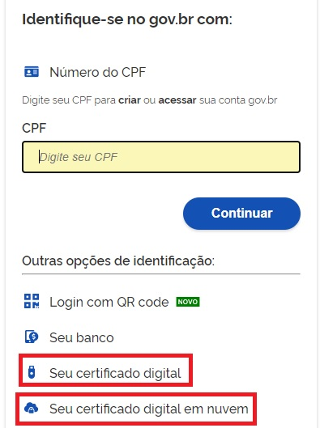
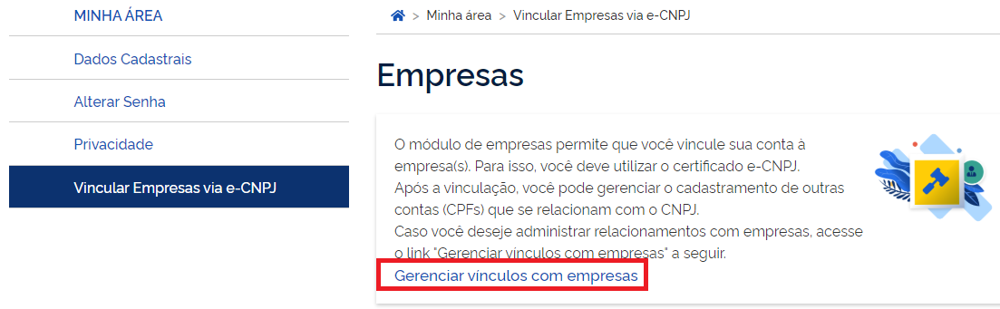
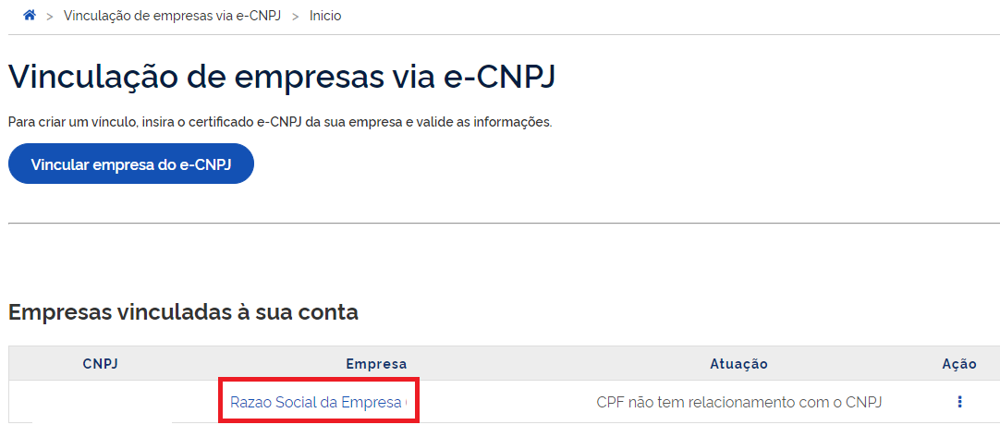
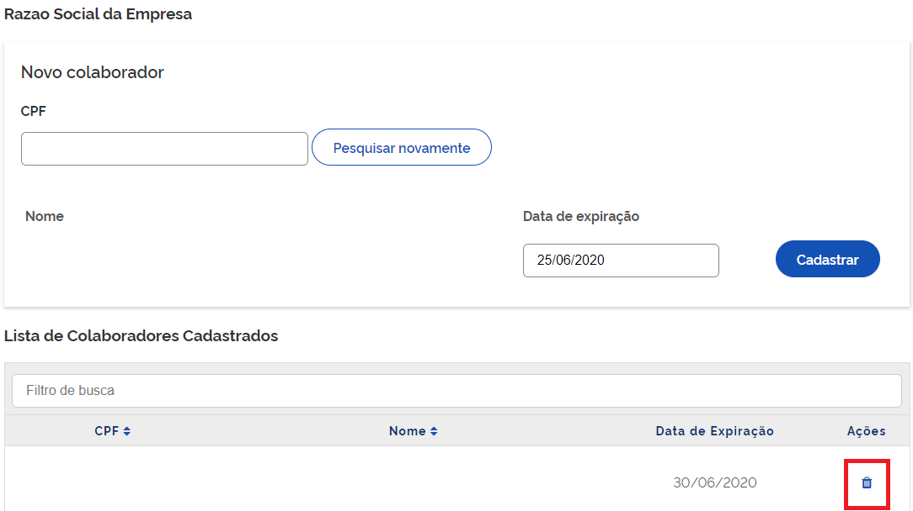

Retirar Colaborador do CNPJ
===========================

Para realizar a retirada de colaboradores, favor seguir os passos:

1. Cidadão aciona o Certificado Digital de Pessoa Jurídica ao computador (Tipo A1 - máquina - ou Tipo A3 - Token).

2. Selecione opção **Certificado Digital** ou **Certificado Digital em nuvem** na tela inicial do https://acesso.gov.br.

3. Siga os procedimentos específicos do tipo de Certificado Digital selecionado para digitar senha e continuar o processo.   

4. Selecione menu **Vincular Empresas via e-CNPJ**, link **Gerenciar Vínculos com Empresas**.

5. Clica no nome da empresa deseja retirar os colaboradores. 	

6. Cidadão aciona o Certificado Digital de Pessoa Jurídica ao computador (Tipo A1 - máquina - ou Tipo A3 - Token) do representante do CNPJ. Localiza o CPF do Colaborador deseja remover. Clica no **botão com ícone de lixo na cor azul**

 
.. |site externo| image:: _images/site-ext.gif
.. _`selo eCNPJ`: comocadastrarCNPJnologinunico.html
            