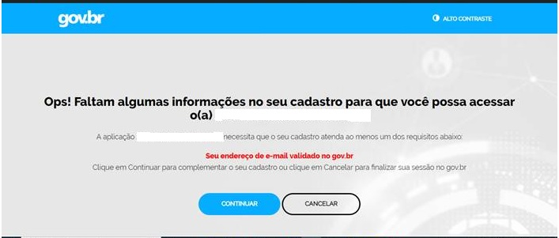

Pedem para complementar dados de email ou telefone no Login Único, o que fazer? 
===============================================================================

Alguns serviços públicos digitais que utilizam o Login Único necessitam de informações de email ou telefone no cadastro do cidadão para continuar a navegação.

Caso às informações não estejam presentes, será apresentada a tela:

Para inserir às informações necessárias para serviço, favor seguir os passos:

1. Clique no botão **Continuar**

.. image:: _images/solicitacaocomplementacaotelefoneemailcomdestaquebotaogovbr.jpg
   :align: center
   :alt:  

2. Insira os dados solicitados, por meio dos passos presentes na `Alteração dos Dados Cadastrais`_   

3. Realizar autenticação no serviço novamente para continuar processo. 

**Possíveis Palavras/Termos (Utilizado para busca no chatbot)**

- complementar dados de email ou telefone no serviço
- autentico no serviço e pede para inserir email/telefone

.. |site externo| image:: _images/site-ext.gif
.. _`Alteração dos Dados Cadastrais` : alterardadoscadastrais.html
            