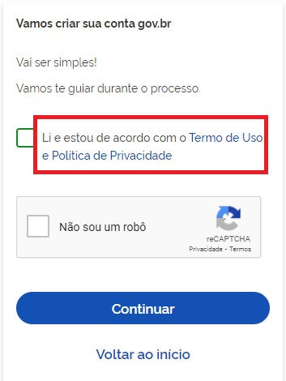

Termo de Uso e Privacidade
==========================

Termo de Uso e Privacidade apresentam informações:

- o funcionamento do serviço gov.br e as regras aplicáveis ao seu uso;
- o arcabouço legal relacionado à prestação do serviço;
- as responsabilidades do usuário ao utilizar o serviço; 
- as responsabilidades da administração pública ao prover o serviço; informações para contato, caso exista alguma dúvida;
- os direitos autorais e a propriedade intelectual;
- foro responsável por eventuais reclamações caso se entenda que as cláusulas deste Termo de Uso tenham sido violadas.
- qual o tratamento dos dados pessoais realizados, de forma automatizada ou não, e a sua finalidade;
- os dados pessoais dos cidadãos que são necessários para a prestação do serviço;
- a forma como eles são coletados;
- se há o compartilhamento de dados com terceiros;
- quais medidas de segurança são implementadas para proteger os dados dos cidadãos.

:download:`Acesso ao Conteúdo do Termo de Uso e Privacidade<_arquivos/TERMO_DE_USO_E_POLITICA_DE_PRIVACIDADE.pdf>`

Para acessar o termo de uso e privacidade da Conta gov.br, clique em **Termos de uso** no momento que realizar o cadastro da conta.

.. |site externo| image:: _images/site-ext.gif
            
